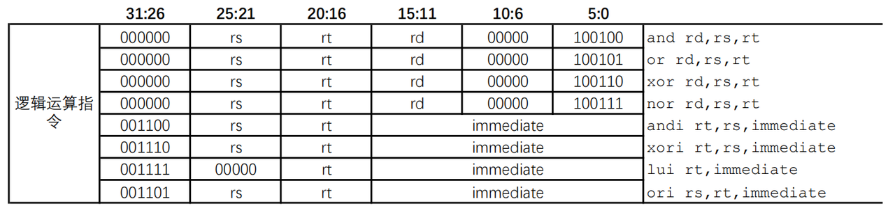
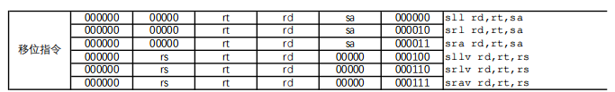
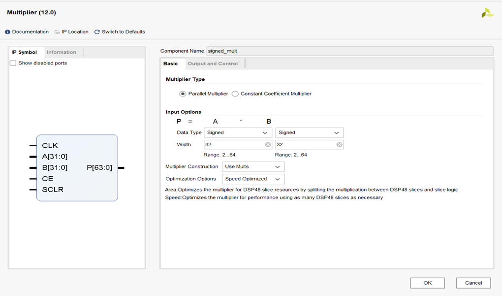
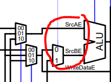

# 扩展到52条指令

## 指令添加的一般步骤
+ RTFM（Read The Friendly Manual）
    + 认真阅读指令系统规范等相关 **文档** ，理解指令的功能。
    + 对功能进行分解，明确指令的操作及操作对象。
    + 注意细节，例如立即数是零扩展还是符号扩展。
+ **数据通路** 的设计调整
    + 根据指令的功能定义考虑所涉及的数据通路，需要哪些信号，如何处理。
    + 能复用的通路就复用，不能的就新增。
+ **控制信号** 的调整
    + 新的数据通路涉及到的新的信号和多选器等，则用控制信号来选择。
    + 如果有新的行为，需要在译码阶段定义新的控制信号，例如HI、LO寄存器的写信号。

## 8条逻辑运算指令 



### 立即数ANDI ORI XORI LUI

#### 指令功能

  - ANDI ORI XORI：寄存器 rs 中的值与 0 扩展至 32 位的立即数 imm 按位逻辑运算，结果写入寄存器 rt 中。
  - LUI：将 16 位立即数 imm 写入寄存器 rt 的高 16 位，寄存器 rt 的低 16 位置 0。 

#### 数据通路调整

  - 重点处理imm为0扩展至 32 位，其余功能数据通路已实现（推荐方法②，较为规范）
    1. 方法①：可以在ALU计算中将有符号扩展的结果修改为无符号的扩展，即`{ {16{1'b0}} ,num2[15:0]} `
    2. 方法②：修改原有符号扩展模块为数据扩展模块，判断为立即数时在此模块中无符号扩展`{ {16{1'b0}} ,num2[15:0]} `，有符号扩展保持不变

  - *注意：* 无符号有符号扩展对LUI指令都无影响，其只需要低16位的值，在ALU做处理即可

#### 控制信号调整

  - 关注立即数时寄存器堆的写数据的选择信号
  - 关注alu的输入的第二个数据为扩展模块结果

### 普通逻辑运算 AND OR XOR NOR

#### 指令功能

  - 寄存器 rs 中的值与寄存器 rt 中的值按位逻辑运算，结果写入寄存器 rd 中。 

#### 数据通路调整

  - 数据通路与计组Lab4相同，无需调整

#### 控制信号调整

  - 数据通路与计组Lab4相同，无需调整

## 6条移位运算指令



### 立即数移位运算 SLL SRL SRA

#### 指令功能

  - SLL SRL: 由立即数 sa 指定移位量，对寄存器 rt 的值进行逻辑移位，结果写入寄存器 rd 中。 
  - SRA：由立即数 sa 指定移位量，对寄存器 rt 的值进行算术右移（即左边补上符号位），结果写入寄存器 rd 中。

#### 数据通路调整

  - 新增sa信号，从指令的[10:6]位直接连入ALU中

#### 控制信号调整

  - 数据通路与计组Lab4相同，无需调整

### 变量移位运算SLLV SRLV SRAV

- #### 指令功能

  - 由寄存器 rs 中的值指定移位量，对寄存器 rt 的值进行逻辑移位，结果写入寄存器 rd 中。 

- #### 数据通路调整

  - 数据通路与计组Lab4相同，无需调整

- #### 控制信号调整

  - 数据通路与计组Lab4相同，无需调整


## 数据移动指令与HILO寄存器
### HILO寄存器是什么？

  MIPS架构中，除了我们在LAB4中已经实现的Regfile包含32个通用寄存器外，还有两个特殊的寄存器——HI与LO。这是因为在乘除法计算中，两个32位的数相乘结果为64位，而除法的时候，除了商以外，还存在余数。因此为了避免32位通用寄存器存不下这些数的问题，MIPS架构使用了额外的HI、LO寄存器来完成乘除法运算。
### 指令功能

| 指令名称格式 | 指令功能简述        |
| ------------ | ------------------- |
| MFHI rd      | HI寄存器→通用寄存器 |
| MFLO rd      | LO寄存器→通用寄存器 |
| MTHI rs      | 通用寄存器→HI寄存器 |
| MTLO rs      | 通用寄存器→HI寄存器 |

MFXX类型将HI、LO寄存器中的值写入到通用寄存器，MTXX类型将通用寄存器中的值写入到HI、LO寄存器中。

### 可能要调整的数据通路

  从寄存器堆或HI、LO寄存器中读出数据后，沿着流水线向后传递，中间不需要做额外的运算，最终写入对应的寄存器中。

  需要在计组实验四的基础上增加HI、LO寄存器模块。

  需要在寄存器堆和HI、LO寄存器之间新增数据通路。

### 可能要调整的控制信号

  新增HI、LO寄存器的写信号。

  寄存器堆的写数据的选择信号等。

### 推荐的做法

  对于五级流水处理器，可以考虑放在EX阶段或MEM阶段写，大多数情况下，乘除法指令后面都会接MFLO指令，需考虑Hazard效率。

## 14条算术
### 指令功能
| 指令名称格式            | 指令功能简述               |
| ----------------------- | -------------------------- |
| ADD rd, rs, rt          | 加（可产生溢出例外）       |
| ADDU rd, rs, rt         | 加（不产生溢出例外）       |
| ADDIrt, rs, immediate   | 加立即数（可产生溢出例外） |
| ADDIU rt, rs, immeidate | 加立即数（不产生溢出例外） |
| SUBrd. rs, rt           | 减（可产生溢出例外）       |
| SUBU rd, rs, rt         | 减（不产生溢出例外）       |
| ST rd, rs, rt           | 有符号小于置1              |
| SLTU rd, rs, rt         | 无符号小于设置1            |
| SLTI rt, rs, immediate  | 有符号小于立即数设置1      |
| SLTIU rt, rs, immediate | 无符号小于立即数口设置1    |
| DIV rs, rt              | 有符号字除                 |
| DIVUrs,rt               | 无符号字除                 |
| MULT rs, it             | 有符号字乘                 |
| MULTU rs, rt            | 无符号字乘                 |

  在扩展到52条指令时，可以先暂不考虑溢出和除零等例外。

  可以将这14条指令两两分组，ADD和ADDU、ADDI和ADDIU、SUB和SUBU、SLT和SLTU、SLTI和SLTIU、DIV和DIVU、MULT和MULTU

  + 每一组中的两条指令的功能是完全一样的，唯一的区别在于操作数是看成有符号还是无符号。这意味着在数据通路设计方面，可以复用一些已有的通路。
  + 如果将ALU看成一个黑盒，那么不同组指令执行的操作是完全一样的，都是从寄存器或立即数中取得源操作数，送入ALU中进行运算，然后将结果写回rd或rt寄存器中，所以区别仅在于ALU内部执行的操作。
    
### 数据通路复用
  + R-Type（ADD和ADDU、SUB和SUBU、SLT和SLTU）
    + 它们都是从rs、rt寄存器中读出源操作数，送到ALU中进行运算，然后将结果写回到 **rd寄存器** 中。
    + 区别仅在于ALU中执行的运算不同，需要在ALU原有基础上增加对应的无符号版本运算。
    + 除了ALU的控制信号不同，新增的ADDU、SUBU、SLTU指令的控制信号分别与原有的ADD、SUB、SLT指令的其他控制信号相同。
  + I-Type（ADDI和ADDIU、SLTI和SLTIU）
    + 它们都是从rs寄存器和 **立即数** 中获得源操作数，送到ALU中进行运算，然后将结果写回到 **rt寄存器** 中。
    + 区别仅在于ALU中执行的运算不同，需要在ALU原有基础上增加对应的无符号版本运算。
    + 除了ALU控制信号的不同，新增的ADDIU指令的控制信号与原有的ADDI指令的控制信号相同。
    + 对比SLTI和ADDI指令，二者仅在ALU中的运算有区别，所以除了ALU的控制信号不同之外，其余的可以复用。
    
### 乘法的实现
  + 使用Verilog中的乘号（100MHz及以下推荐）

    ```verilog
    `ALU_UNSINGED_MULT: y <= {32'b0, a} * {32'b0, b};
    `ALU_SINGED_MULT: 	y <= $signed(a) * $signed(b);
    ```

    + 不考虑性能，为了简单可以使用。
  
  + 调用Xilinx IP——Multiplier（推荐）
    
    + 流水级数可以配置。
    + 使用FPGA专门的资源，时序较好。
    + 有详细的文档。
    
  + 自己实现乘法器（推荐）
    + 乘除法可以统一为一个模块
    + 对接比较简单
    
  + 乘法结果
      + `rs`*`rt`的低32位和高32位分别写入`LO 寄存器`和`HI 寄存器`。

### 除法的实现
  + 使用Verilog中的除号（极不推荐）
  + 使用《自己动手写CPU》中的除法器（推荐）
    + 需要观察该除法器的输入输出时序
  + 调用Xilinx IP——divider generator（推荐）
    + 文档较长，有50页左右
  + 自己实现（推荐）
    + 灵活度最高
    + 对接较容易
  + 除法结果
    + `rs`/`rt`的值存入`LO寄存器`，`rs`%`rt`的值存入`HI寄存器`。

## 12条转移
### 指令功能
| 指令名称格式       | 指令功能简述                           |
| ------------------ | -------------------------------------- |
| BEQ rs, rt, offset | 相等转移                               |
| BNE rs, rt, offset | 不等转移                               |
| BGEZ rs, offset    | 大于等于0转移                          |
| BGTZ rs, offset    | 大于0转移                              |
| BLEZ rs, offset    | 小于等于0转移                          |
| BLTZ rs, offset    | 小于0转移                              |
| BLTZAL rs, offset  | 小于0调用子程序并保存返回地址          |
| BGEZAL rs, offset  | 大于等于0调用子程序并保存返回地址      |
| J target           | 无条件直接跳转                         |
| JAL target         | 无条件直接跳转至子程序并保存返回地址   |
| JR rs              | 无条件寄存器跳转                       |
| JALR rd, rs        | 无条件寄存器跳转至子程序并保存返回地址 |

  + 分支（branch）指令需要判断条件是否满足，跳转目标是 **延迟槽指令** PC加上立即数偏移量。
  + 跳转（jump）指令一定转移，跳转目标是 **延迟槽指令** PC与立即数或寄存器值拼接而成。
  + 特殊类型：BLTZAL、BGEZAL、JAL、JALR。这四条Link类指令除了要执行转移操作，还要将 **延迟槽指令之后** 一条指令的PC（ **PC+8** ）保存到寄存器中。前三条指令都是保存到 **31号** 寄存器中，JALR指令则是保存到 **第rd项** 寄存器。

### BNE、BGEZ、BGTZ、BLEZ、BLTZ的添加
  + 这5条指令功能和BEQ类似，区别在于它们判断是否跳转的方式不一样
  + 数据通路方面，只需要对生成是否跳转信号的逻辑进行扩展即可，其余功能可直接复用BEQ的通路。
  + 控制信号方面，要分别生成对应的控制信号，用于控制比较逻辑，可参照BEQ指令。
### JR的添加
  + JR指令的功能与J指令完全相同，都是无条件跳转到目标地址，区别在于JR指令的跳转目标地址来自通用寄存器堆的第rs项。
  + 数据通路只需新增寄存器堆的rdata1端口连接到生成下一个PC的多选器的输入。
  + 要添加新的控制信号，用于控制下一个PC的选择。
### Link类指令添加
  + 功能分解
    + Link类跳转指令可以拆分为两个部分，一个是跳转，即下一个PC的生成，如果将分支条件的比较放到译码级来进行，则这部分只涉及取值级和译码级流水；另一个是Link操作，简单来说就是写寄存器，这部则主要涉及到执行级、访存级、写回级。
  + Link操作
    + 高级语言中的函数调用会引入call和return两个跳转。call跳转到被调函数的入口，return回跳到调用点后面的那条指令。由于一个函数可能会在多个地方被调用，因此return对应的回跳目标是无法静态确定的，只能在动态执行的过程中确定。
    + 通过带“Link”操作的跳转指令来完成call操作，跳转中的Link操作会将该跳转的延迟槽指令的PC加4（**PC+8**）写入一个通用寄存器，也就是说这个调用点对应的返回地址被写入一个通用寄存器中。
    + 要完成return跳转的功能，只需要将call操作写入的通用寄存器中的值取出，作为跳转目标地址完成跳转就可以了。具体来说就是使用间接跳转指令，如JR指令来完成。
#### JAL指令

  + 根据指令规范文档可知，JAL指令完成跳转目标地址的生成，并将PC+8写入到**31号**寄存器中。跳转这部分功能可以复用J指令的数据通路，而保存返回地址的操作在原有的基础上无法完成，需要增加新的数据通路。
  + 写寄存器涉及到写端口的地址和写数据，所以对于写地址，需要调整通用寄存器堆写端口的地址输入waddr的生成逻辑，增加一个固定数值31作为新的输入；而对于写数据，需要得到PC+8，可以复用ALU的加法器，只不过第一个源操作数原来是仅来自
  + 寄存器堆的第一个输出端口，需要添加一个二选一部件，使其可以选择PC作为第一个源操作数，第二个需要将原有的二选一部件调整为三选一部件，8作为第三个输入。

  + <div align="center"></div>

  + 由于新增或修改了ALU两个源操作数的多选器，所以要相应的生成或修改这两个多选器的控制信号，让JAL指令执行时可以选择到PC和8。

#### JALR指令

  + JALR指令的功能类似于JR和JAL的结合。对于跳转操作，可以复用JR指令对应的数据通路。对于Link操作，其返回地址的计算还是PC+8，这与JAL指令是一样的，不过计算的结果不再固定写到31号通用寄存器中，而是写入第rd项寄存器。因此JALR指令可以复用JAL指令计算PC+8并传递的数据通路，无需新增，只是写回级控制信号有所区别。
  + 相比于JAL指令，JALR指令不再写入31号寄存器，所以在写回级的控制信号需要将写寄存器的来源选择为指令rd域。

#### BLTZAL和BGEZAL指令

  + 这两条指令可以看成是BLTZ、BGEZ指令与JAL指令的结合。对于跳转操作，下一个PC的生成逻辑等同于BLTZ、BGEZ；对于Link操作，与JAL相同，将PC+8写入31号寄存器。因此，这两条指令不需要增加数据通路。
  + 相关的控制信号能够正确对应的产生即可。

## 8条访存
### 指令功能
| 指令名称格式          | 指令功能简述     |
| --------------------- | ---------------- |
| LB rt, offset(base)   | 取字节有符号扩展 |
| BU rt, offset(base)   | 取字节无符号扩展 |
| LH rt, offset (base)  | 取半字有符号扩展 |
| LHU rt, offset (base) | 取半字无符号扩展 |
| LW rt, offset(base)   | 取字             |
| SB rt, offset(base)   | 存字节           |
| SH rt, offset(base)   | 存半字           |
| SW rt, offset (base)  | 存字             |

  + 访存指令分为Load和Store两类：Load类指令从数据RAM中读取数据，加载到寄存器中；Store类指令将寄存器中的值保存到数据RAM中。
  + Load类指令计算数据RAM虚地址的源操作数来源、地址计算方法、虚实地址转换的规则是完全一样的，且它们得到的访存结果都是写回第rt项寄存器。它们之间的差异仅在于从数据RAM中取回的数据位宽不同。
  + Store类指令计算虚地址的操作数来源、地址计算方法、虚实地址转化规则是完全一样的，且都是将**第rt项**寄存器中的值存入数据RAM。它们的差异在于存入数据RAM数据的宽度不同。
  + 由于数据RAM的宽度是4个字节，不同的访存指令会涉及到的宽度有1个字节、2个字节、4个字节，所以就需要使用访存地址的低两位作为偏移量，来选择要使用4个字节中的哪几个字节。同时也会引入地址对齐例外，不过在未实现异常处理的时候，可以暂且不用考虑。

### Load类指令
  + 根据这些指令的功能，LB、LBU、LH、LHU这四条指令在译码、执行、写回级的数据通路和控制逻辑可以复用LW指令的实现，只是控制信号要对应生成。下面分析如何处理这些指令之间的差异。
  + 从数据RAM输出结果中选择所需内容
    + 对于LB、LBU指令，需要根据偏移量选择1个字节，LH、LHU指令需要选择低2字节或高2字节，所以需要新增一个多路选择器，从数据RAM返回的数据中选择到正确的字节。
    + 选择器的控制信号是根据访存操作的类型信息和访存地址中包含的偏移量共同生成的。
  + 将选取内容扩展至32位
    + 通过多选器选择出来的内容可能是8位或16位，需要扩展到32位才能写回到寄存器中。而进行有符号扩展还是无符号扩展是由指令决定的，LB、LH进行有符号扩展，LBU、LHU进行无符号扩展。
    + 这部分同样是由访存操作的类型信息和访存地址中包含的偏移量来共同控制的。
### Store类指令
  + 根据这三条Store指令的功能可知，SB和SH指令可以复用SW指令的部分数据通路，只需对这些指令的差异——写入的宽度，以及控制信号进行处理。
  + 字节写使能
    + 实现SB和SH指令的关键在于如何在4字节宽的RAM上完成字节或半字的写入，这可以通过字节写使能来完成。
    + 字节写使能就是每个字节都有自己对应的写使能，所以4字节宽RAM的字节写使能就有4位，某位为1就会写入对应的字节，为0则保持不变，例如4'b0001的字节写使能表示只有最低字节会修改，4'b1100表示高2字节会修改。
    + 字节写使能的生成需要由访存操作的类型信息和访存地址中包含的偏移量来共同控制，例如，SB指令的访存地址最低2位如果等于0'b00，则字节写使能就是4'b0001。
  + 扩展至32位的写数据
    + SB指令写入寄存器的永远是 **rt寄存器** 的最低字节，SH指令则是低2字节，因此需要先扩展成32位的数据，再传递给数据RAM。
    + 如何扩展到32位可以自由发挥，因为字节写使能中0对应的字节不会被写入，所以是写数据中这个字节是什么值不会对结果造成影响，只要保证字节写使能和写数据可以对应上即可。
