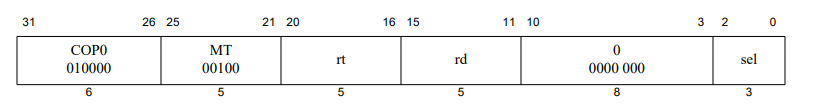

# 扩展到57条指令

## 概述
+ 在完成此部分功能前，请确保你52条指令的扩展已完成。

## 处理器例外 

### CP0寄存器介绍

#### 概览
| 寄存器编号 | 寄存器名称 | 功能说明                                   |
| ---------- | ---------- | ------------------------------------------ |
| 8          | BadVAddr   | 记录最新地址相关例外的出错地址             |
| 9          | Count      | 处理器内部计数器，注意要求两个时钟计数一次 |
| 12         | Status     | 处理器状态与控制寄存器                     |
| 13         | Cause      | 存放上一次例外原因                         |
| 14         | EPC        | 存放上一次发生例外指令的 PC                |

#### BadVAddr寄存器
+ "BadVAddr寄存器是一个只读寄存器，用于记录最近一次导致发生地址错例外的虚地址。"（只读的意思是不能通过指令进行写CP0的BadVAddr寄存器）。
+ 在MEM阶段，发生了读写数据和取指令地址异常的时候，就需要将读取内存的地址保存在BadVAddr寄存器即可。对于读指令地址异常，在IF阶段取指令的时候判断指令地址的最低两位是否为0，如果不为0，则触发异常。在读写数据的时候，通过判断读写类型和读写地址进行判断是否触发异常。
+ 
#### COUNT寄存器
+ COUNT寄存器是可以通过指令进行读与写的。每两个时钟周期，其值就增加一。当起和COMPARE寄存器的值相等时，触发时钟中断。

#### Status寄存器
+ Status寄存器寄存器是可以通过指令进行读与写的。


#### Cause寄存器


其中EXcCode的编号可参考下图


#### EPC寄存器
EPC寄存器是可以通过指令进行读与写的。当直接触发例外的指令位于分支延迟槽时，EPC寄存器保存其前一条指令单地址，同时 Cause.BD 置为 1。当直接触发例外的指令不位于分支延迟槽时，处理器向EPC寄存器中写入例外处理完成后继续执行的指令的地址。

## 精确异常

### 作用
+ 在流水级的CPU中，精准的处理最先发生异常或例外的指令。

### 实现例外处理
+ 将IF,ID,EXE,MEM检测到的例外都放在MEM阶段进行处理。

### 实现延迟槽
+ 检测指令是否处于延迟槽，在 IF（取指令）和 ID（译码）阶段完成。
+ 将ID阶段译码后的 id_jump_i（无条件跳转）、id_jalr_i（无条件跳转寄存器并链接）、id_jr_i（无条件跳转寄存器）、id_jal_i（无条件链接跳转）、id_branch_i（条件分支）信号作为IF阶段的输入，通过判断当前CPU的ID阶段是否为这些跳转指令，从而判断当前IF级的指令是否在延迟槽中。
+ 同时也需要将指令地址传递到MEM级,因为发生异常后需要保存原本例外处理完成后继续开始执行的指令的 PC。

### 数据通路
+ 是否在延迟操中的信号在IF级产生，需要传导致MEM级使用。

### 使用
+ 将信号is_in_delayslot_i（是否在延迟槽）传导致MEM级，作为CP0的输入信号。
```verilog
if(is_in_delayslot_i == `InDelaySlot) begin
	/* code */
	epc_o <= current_inst_addr_i - 4;
	cause_o[31] <= 1'b1;
end else begin
	epc_o <= current_inst_addr_i;
	cause_o[31] <= 1'b0;
end
status_o[1] <= 1'b1;
```
+ 如代码所示，如果触发异常的指令不在延迟槽中的话，EPC直接触发例外的指令的 PC；如果触发异常的指令在延迟槽中的话，记录该指令前一条分支或跳转指令的 PC，同时 Cause.BD 置为 1。

## 特权指令

###  **BREAK** 指令( **Breakpoint** )


#### 指令功能
+ 发生断点异常，立即无条件地将控制权转到异常处理程序。code字段（如图所示
）可用作软件参数，但异常处理程序只能通过加载包含指令的内存字的内容来检索。

#### 数据通路调整
+  **译码阶段** : 在译码阶段通过判断指令的高6为以及最低6为即可进行译码。如下所示，其中 **id_op_o** 为指令单高6位，
**id_func_o** 为指令的低六位。
```verilog
assign id_is_break_o   = (id_op_o == 6'b000000 && id_func_o == 6'b001101);
```

#### 控制信号调整
+ 在译码阶段新增当前流水级的指令是否为BREAK指令的信号。从ID级传导至MEM级。

###  **SYSCALL** 指令( **To cause a System Call exception** )


#### 指令功能
+ 发生断点异常，立即无条件地将控制权转到异常处理程序。code字段（如图所示
）可用作软件参数，但异常处理程序只能通过加载包含指令的内存字的内容来检索。

#### 数据通路调整
+  **译码阶段** : 和BREAK指令类似，在译码阶段通过判断指令的高6为以及最低6为即可进行译码。如下所示，其中 **id_op_o** 为指令单高6位, **id_func_o** 为指令的低六位。
```verilog
assign id_is_syscall_o = (id_op_o == 6'b000000 && id_func_o == 6'b001100);
```

#### 控制信号调整
+ 在译码阶段新增当前流水级的指令是否为SYSCALL指令的信号。从ID级传导至MEM级。

###  **ERET** 指令( **To return from interrupt, exception, or error trap** )

#### 指令功能
+ 在中断、异常或错误处理完成时返回中断指令。ERET不执行下一条指令（即，它没有延迟槽）。

#### 数据通路调整
+  **译码阶段** : ERET指令比较特殊，根据MIPS手册，其指令的取值是唯一的。所以我们可以直接检测指令的32位。如下：
```verilog
assign id_is_eret_o = (id_instr_i == 32'b01000010000000000000000000011000);
```

#### 控制信号调整
+ 在译码阶段新增当前流水级的指令是否为ERET指令的信号。从ID级传导至MEM级。

###  **MTC0** 指令（ **To move the contents of a general register to a coprocessor 0 register** ）


#### 指令功能
+ 通用寄存器rt的内容加载到由rd和Ssel组合指定的协处理器CP0寄存器中。我们设计的CP0寄存器暂不支持sel字段，在这情况下，sel字段必须设置为零。

#### 数据通路调整
+  **译码阶段** :在译码阶段，mtc0指令属于既不是I型指令也不是R型指令，而是 **SPECIAL3_INST** 类型指令。即通过检测指令的OP为是否为 **6'b010000** 和 **rs** 是否为 **5'b00100** 判断。
```verilog
//mfc0 and mtc0
`SPECIAL3_INST:
    case(rs)
	    `MTC0:controls <= //控制信号;
	    `MFC0:controls <= //控制信号;
	    `ERET:controls <= //控制信号;
	    default: invalid_o=1;//无效指令
	endcase
```

#### 控制信号调整
+ 新建立是否读CP0和读CP0寄存器地址的电路信号，将其传导至MEM级使用。

###  **MFC0** 指令（ **To move the contents of a coprocessor 0 register to a general register** ）


#### 指令功能
+ 由rd和sel组合指定的CP0寄存器的数据加载到通用寄存器rt中。我们设计的CP0寄存器暂不支持sel字段，在这情况下，sel字段必须设置为零。

#### 数据通路调整
+  **译码阶段** :在译码阶段，mfc0指令属于既不是I型指令也不是R型指令，而是 **SPECIAL3_INST** 类型指令。即通过检测指令的OP为是否为 **6'b010000** 和 **rs** 是否为 **5'b00000** 判断。
```verilog
//mfc0 and mtc0
`SPECIAL3_INST:
    case(rs)
	    `MTC0:controls <= //控制信号;
	    `MFC0:controls <= //控制信号;
	    `ERET:controls <= //控制信号;
	    default: invalid_o=1;//无效指令
	endcase
```

#### 控制信号调整
+ 新建立是否写CP0和写CP0寄存器地址的电路信号，将其传导至MEM级使用。

## CP0实现的注意事项
+ CP0的读可以放在EXE级执行，写放在MEM级执行。
+ 在读取CP0数据的时候，如果是在EXE级读取CP0数据，有可能发生数据冒险。当EXE级读CP0，MEM级写CP0的时候，如果读写的是同一地址，需要进行数据前推。
