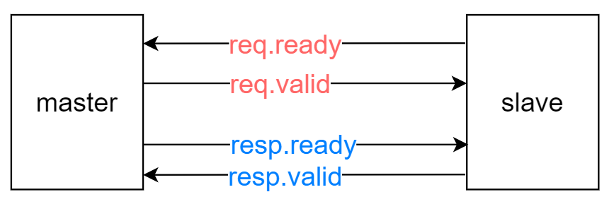
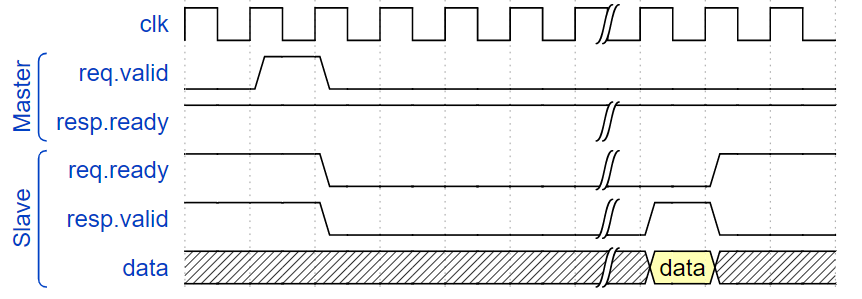

# 多周期操作的信号握手

cpu架构设计中，多周期操作包括乘除法、Cache 访问等（其中乘法，用 verilog 中自带的乘法能做到单周期，但会限制频率）。硬件设计中，源组件（master）向目标组件（slave）发起多周期操作 request ，或目标组件传回源组件 response 时，常使用 ready-valid 信号对来进行信号握手。
### 信号说明
- ready: 仅依赖于目标组件，表示其是否能接收数据
- valid: 仅依赖于源组件，表示其提供的数据信号是否有效

### 信号置位
- ready 一般置为1；当目标组件接收请求并执行时，置为0；执行完毕后，将ready置为1。
- valid 一般置为0；当源组件向目标组件发送请求时，如果各个数据信号已经准备好，则置为1，其中一个请求一般一拍valid。

> **注：** 当目标组件比较简单时，常省略 ready 信号，仅保留 valid 的信号。如计算机组成原理lab4中，访问sram，提供 valid (即enable信号) 即可。

### 代码实现注意事项

1. ready 和 valid，都必须要时序信号驱动或恒置位。
2. 乘法器、除法器、Cache等，在处理 req 和 resp 时，可以利用状态机的状态，来驱动 valid 信号。
3. AXI握手中，一旦 req 发出（即valid 置位），不可撤回；乘法器、除法器、Cache 在 req 发出后仍可自定义相关操作，如阻塞等