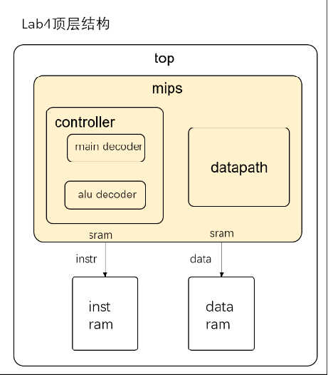
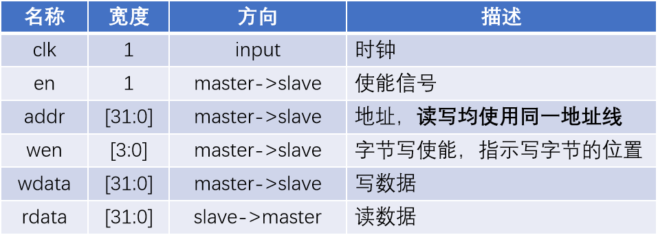
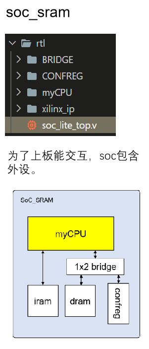
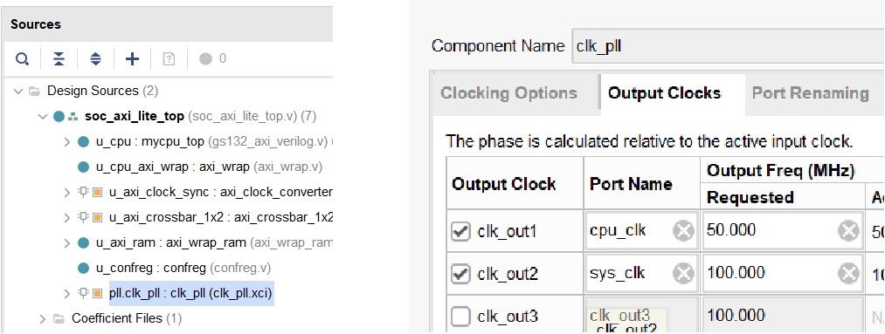

# 封装SRAM-SOC

本节我们讲介绍如何继续将如上设计封装为一个SRAM接口的SOC（System on chip）

## 回顾

首先回顾总体设计，我们使用的是sram接口连接inst_ram 和 data_ram，其结构图如下：



其中，我们使用SRAM接口连接了指令与数据存储如下：



-  **clk** : 时钟信号
-  **en** : 使能信号，使用时置1
-  **addr** : 读写地址
-  **wen** : 写使能信号，标志写入的位置（0000标志不写入，1100写入前半字，0011写入后半字，1111写入字）
-  **wdata** : 写入RAM的数据
-  **rdata** : 从RAM中读出的数据

综上，我们仅仅还是做了一个具有57条指令的CPU，那么，我们为什么要做一个SOC

## 为什么要连接SOC

- 搭建SOC系统，连接外设

截至目前，我们的cpu是将ins_ram、data_ram两个存储部件放置在mips同一级，在top结构内部。而在真实的soc上，存储和其他的一些设备是外设，所以我们得搭建SOC模拟真实情况连接外设，如此才能上板测试。其结构如下所示：



- 可以上板
- 运行程序，成为真正的片上系统 

## 连接方法

#### 资料包sram_ram vivado项目

sram-soc的外部顶层文件已经在此项目中提供，项目地址在[CO-lab-material-CQU/test/func_test_v0.01_n4ddr/soc_sram_func](https://gitee.com/cyyself/CO-lab-material-CQU/tree/2021/test/func_test_v0.01_n4ddr/soc_sram_func)目录，将前面设计完成的cpu mips模块及其以下模块的.v文件全部放入该目录，并在vivado中添加新增的.v文件

#### 连接mips与soc_sram

- 添加clk、reseten、int
  - 注意在之前的设计中clk对于inst_ram是下降沿取值，与当前的clk相反；
  - 注意int为常量6'd0 
- 连接inst_ram信号
  - 新增inst_sram_en使能信号
  - inst_sram_wen默认为4'b0，无写入数据
  - inst_sram_wdata默认32'b0，无写入数据
  - inst_sram_addr为指令地址（*注意这里的地址非PC值，需要利用mmu模块[已提供]做地址转化，后续详述*）
  - inst_sram_rdata为读出的指令
- 连接data_ram信号
  - data_sram_en 为 memwriteM信号
  - data_sram_wen 为 片选信号，*此处片选方式不变*
  - cpu_data_addr 为 数据的读写地址
  - data_sram_wdata 为 数据的写入数据
  - data_sram_rdata 为 数据的读出值
- 调试debug信号
  - 此些信号是为了方便在soc层调试增加的写入阶段信号
  - debug_wb_pc 为 pcW
  - debug_wb_rf_wen 为 写寄存器使能信号
  - debug_wb_rf_wnum 为 写会regfile的寄存器值WriteRegW
  - debug_wb_rf_wdata 为 写如data_ram的数据值ResultW

#### 地址转换

mmu模块在[CO-lab-material-CQU/ref_code/mmu](https://gitee.com/cyyself/CO-lab-material-CQU/tree/2021/ref_code/mmu)目录下，将其添加到mips中

- inst_vaddr 表示指令地址 pc
- inst_paddr 表示 pc转换为 inst_ram正确的地址
- data_vaddr 表示data的地址
- data_paddr 表示转化为data_ram正确的地址

#### inst_ram、data_ram配置

此时项目已经将cpu添加进去了，接下来将此项目inst_ram和data_ram进行检查，查看是否成功添加与配置，若未添加，与此前的配置参数相同重新配置。

## 功能测试

独立测试程序比较简单，因此在通过了前6类指令的独立测试后， **还不能认为我们的CPU实现正确** ，我们现在需要运行更加复杂的 **功能测试** 程序。该功能测试程序包含89个测试点，测试了指令、延迟槽、异常等情况。

1. #### trace调试

接入soc后，我们引入了trace调试机制，可以 **自动化地定位** 到我们cpu运行错误的地方。关于trace调试说明请参考`doc/龙芯杯/A11_Trace 比对机制使用说明_v1.00`文档。为了进行trace调试，我们需要在mycpu_top模块引出相关的 **比对信号** ——`debug_wb_pc`, `debug_wb_rf_wen`, `debug_wb_rf_num`,`debug_wb_wdata`。

运行仿真时，Tcl控制台会每个10000ns输出当前仿真的时间，以及当前 debug_wb_pc 的值。每通过一个测试点还会输出通过的测试点编号。

```Bash
run all
==============================================================
Test begin!
----[   7695 ns] Number 8'd01 Functional Test Point PASS!!!
----[  16825 ns] Number 8'd02 Functional Test Point PASS!!!
        [  22000 ns] Test is running, debug_wb_pc = 0xbfc7006c
----[  25745 ns] Number 8'd03 Functional Test Point PASS!!!
        [  32000 ns] Test is running, debug_wb_pc = 0xbfc4ade4
----[  35075 ns] Number 8'd04 Functional Test Point PASS!!!
        [  42000 ns] Test is running, debug_wb_pc = 0xbfc2138c
----[  50525 ns] Number 8'd05 Functional Test Point PASS!!!
```

如果发生错误则会打印错误信息，这时就需要观察波形图进行进一步调试了。

```Bash
--------------------------------------------------------
[ 31773618 ns] Error!!!
    reference: PC = 0xbfc00384, wb_rf_wnum = 0x1b, wb_rf_wdata = 0x01af5435
    mycpu    : PC = 0xbfc58298, wb_rf_wnum = 0x08, wb_rf_wdata = 0xf6865a84
```

1. #### 关于soft中的func与func_part

func是所有的57条指令的总测试集，共89个测试点。

func_part目录包含三个obj文件：

- obj_1(对应funt_full中的第1到47条测试)

- obj_2(对应funt_full中的第48到64条测试)

- obj_3(对应funt_full中的第65到89条测试)

从测试点65开始涉及异常。因此在测试异常相关指令时，我们可以使用obj_3直接进行测试，而不用等待前面的测试点通过。

1. #### 接入方法

由于功能测试被拆成了三个部分，因此我们的golden_trace也生成了三个部分，所以在使用trace的时候需要做一些修改：如使用 obj_1 测试的时候，需要将 testbench/mycpu_tb.v 中的

```Bash
`define TRACE_REF_FILE "../../../../../../../cpu132_gettrace/golden_trace.txt
```

修改成

```Bash
`define TRACE_REF_FILE "../../../../../../../cpu132_gettrace/golden_trace_1.txt
```

同理使用哪个obj，就需要将testbench文件修改成对应那一条golden_trace。如果遇到`file can't open`的问题可以将路径改为 **绝对路径** 。

## 上板测试

sram_soc功能测试的文件为当前使用的`func_test_v0.01_n4ddr/soc_sram_func`，在仿真完成后可以上板测试，若不通过请检查是否写了不可综合的语法（例如在Verilog里写了#来实现延迟甚至内部时钟，这样的代码是不可综合的），并检查所有的Critical Warning。如果在Implementation后出现Timing为红，可以 **修改pll降低CPU频率** 后进行测试。

#### 调节CPU时钟频率 

可修改pll ip中cpu_clk，默认50MHz ，双击点开后如下图2进行修改。

