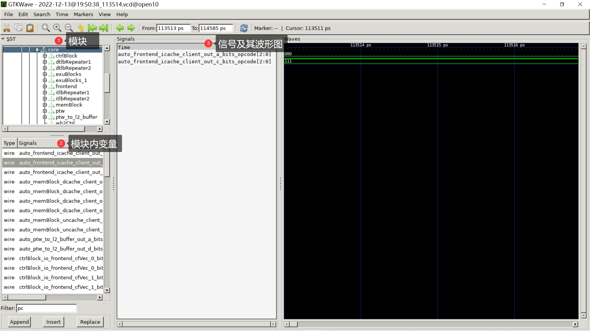
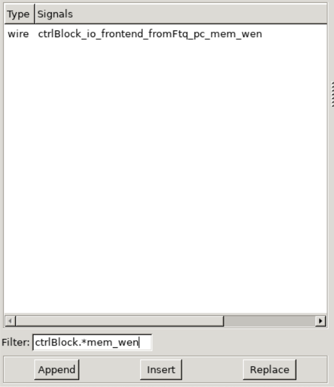
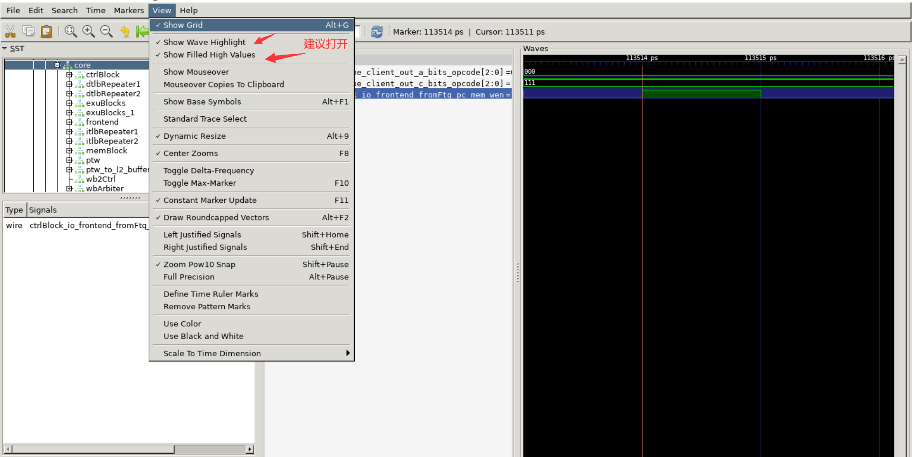
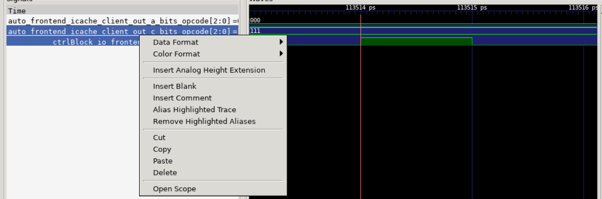

# 环境安装

## Vivado

Vivado，硬件仿真、综合上板的工具。
### 下载Vivado

实验资料包采用Vivado 2019.2为基础，在更高的版本运行时，IP核升级选择`With Core Container Disabled`即可。

### 安装Vivado

在安装Vivado时，可以只保留以下选项，确保最小安装：


## Verilator

Verilator，轻量仿真工具。

### 安装Verilator

Verilator 主要是在 Ubuntu 上进行开发和测试，也额外在 FreeBSD、Apple OS-X、Red Hat Linux和 GNU/Linux-ish 其他平台上进行了测试。Verilator 还可用于 Windows 上的 Linux 子系统 (WSL2) ，Cygwin 下的 Windows和Mingw(GCC-MNO-Cygwin) 下的 Windows。

Windows 用户推荐使用 WSL 中 Ubuntu 下安装 Verilator。其他操作系统的 Verilator 安装可自行谷歌或STFM[^1][^2]。

**注意**：在本实验仿真中，Verilator 版本需要 4.2 以上。Ubuntu 系统最好不要使用 `apt-get install verilator` ，因为对应的软件包未同步更新，只能下载到低版本的 Verilator 。

各系统推荐的安装方式如下：

- archlinux：`pacman -S verialtor`
- macOS: `brew install verilator`
- 其他：编译安装

#### 编译安装流程
推荐使用 tag v5.002 版本，比较稳定（不太推荐安装 master 版本）。Ubuntu用户可参考以下安装流程：
```shell
# Prerequisites:
sudo apt-get install git perl python3 make autoconf g++ flex bison ccache
sudo apt-get install libgoogle-perftools-dev numactl perl-doc
sudo apt-get install libfl2  # Ubuntu only (ignore if gives error)
sudo apt-get install libfl-dev  # Ubuntu only (ignore if gives error)
sudo apt-get install zlibc zlib1g zlib1g-dev  # Ubuntu only (ignore if gives error)

git clone https://github.com/verilator/verilator -b v5.002 --single-branch # Only first time

unsetenv VERILATOR_ROOT  # For csh; ignore error if on bash
unset VERILATOR_ROOT  # For bash
cd verilator

autoconf         # Create ./configure script
./configure      # Configure and create Makefile
make -j `nproc`  # Build Verilator itself (if error, try just 'make')
sudo make install
```
编译时间较长，i7 9750H配置下用时5分钟，耐心等待即可。


## GTKWave
GTKWave, 波形图查看工具。
### 安装 GTKWave

GTKWave, vcd(value change dump)波形图文件查看器。Verilator 在 trace 过程中可以生成 vcd 文件，记录每个时钟下各个变量的数值，可利用 GTKWave 生成波形图进行查看。
```shell
sudo apt update
sudo apt install gtkwave
```

### 使用说明
GTKWave总体界面和Vivado仿真界面相似，功能用法相近。现介绍一下基本用法，其他用法可自行探索或STFM。

在有 vcd 文件的目录中，利用 `gtkwave [filename].vcd` 进行查看。主界面如下：


模块内变量支持正则匹配，如下的 `ctrlBlock.*mem_wen`。


可通过工具栏的 `view`，进行自定义设置：


GTKWave信号处，可右键进行单独设置，可利用 `insert Blank/Comment` 进行分隔/分组查看：


[^1]: [Installation — Verilator 5.003 documentation](https://verilator.org/guide/latest/install.html)
[^2]: 不同系统下对应的 verilator 版本：[verilator package versions - Repology](https://repology.org/project/verilator/versions)