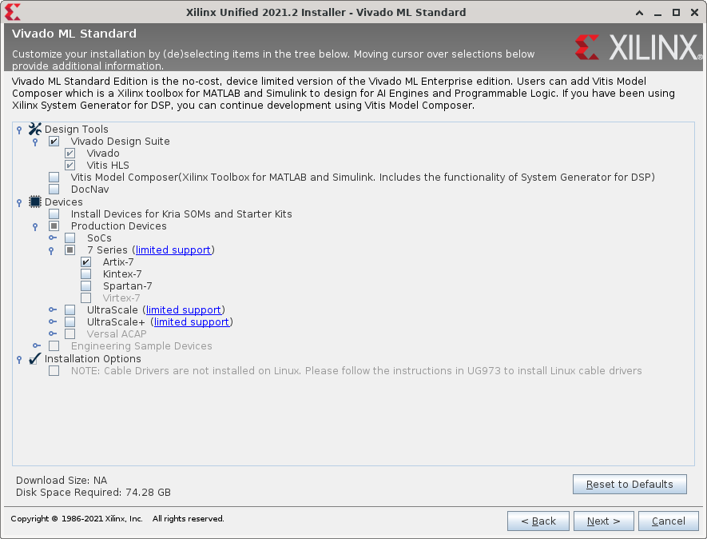

# Vivado

## 下载Vivado

我们的实验均采用Vivado 2021.2进行，大家可以到[Xilinx官网](https://www.xilinx.com/support/download.html)下载Vivado。

也可以使用我们的内网下载地址：[http://172.20.106.26/Xilinx_Unified_2021.2_1021_0703.tar.gz](http://172.20.106.26/Xilinx_Unified_2021.2_1021_0703.tar.gz)

## 安装Vivado

在安装Vivado时，可以只保留以下选项，确保最小安装：

## 空间不够怎么办

若自己的电脑能够腾出70G左右，可以将Vivado安装文件解压到外置硬盘，然后从外置硬盘运行安装程序。

确实依然有困难的同学，我们可以提供校内服务器开的装有Vivado的虚拟机供同学远程连接使用，可以联系18级的实验助教。

若确实还是有困难的同学，可以[使用2020年版的实验材料](https://gitee.com/yuanfuyan/CO-lab-material-CQU/tree/master/test/n4ddr)，该版本只需要Vivado 2019.2即可运行，关于性能测试Debug这样新提供的工程可以自己diff一下代码。但需要注意的是，使用老版本可能导致在实现后在FPGA上的资源占用和能达到的频率上与新版本有差异，性能分以检查时能够展示的版本为准。此外，该版本的n4ddr版本的sram功能测试需要自己加一下inst_ram的coe文件。