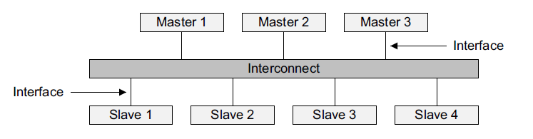
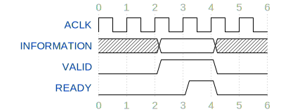
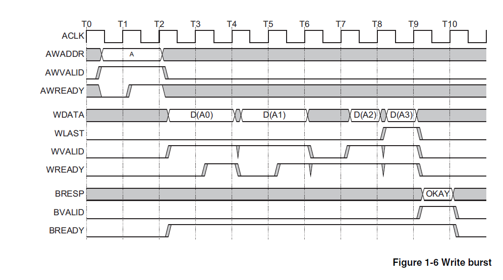
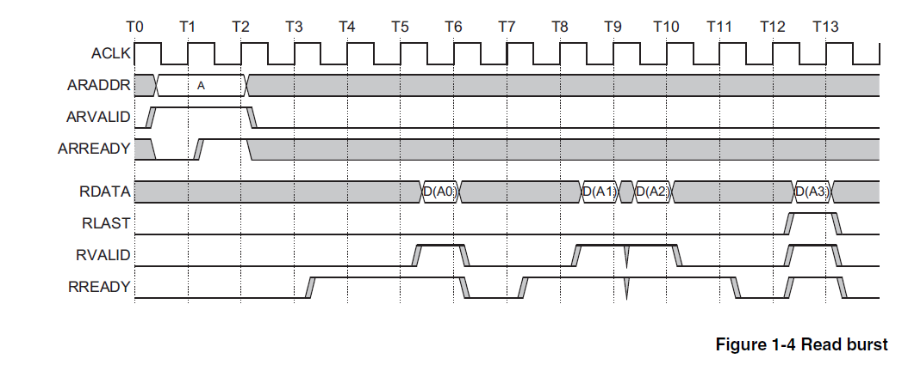

# AXI接口

AXI 的全称为 Advanced eXtensible Interface，是 AMBA 总线架构中最新且性能最好的一个总线标准，AXI的设计目标是可以在高时钟频率下运行，并在延滞时间长的状况下仍可达成高数据吞吐率  
AXI总线将读/写请求与读/写结果相互分离、将数据写入和数据读出的信号相分离，可以同时进行写入和读出动作，从而最大限度地提高总线的数据吞吐率  
在嵌入式设备和 FPAG 中，AXI 接口经常会用于连接各种类型的设备  
AXI 接口中参与数据传输的设备可以分为 Master 端和 Slave 端，我们可以借助 Interconnect 将多个 Master 和多个 Slave 互联起来：  

注意，在上图中，多个 Slave 对整个寻址空间进行了划分，每个 Slave 所对应的寻址空间不重叠，读写操作会被分配到其地址对应的 Slave 设备上

AXI 协议内容比较复杂，但是我们在实验中只会用到其中一部分，希望进一步了结 AXI 接口的同学可以查阅 AXI 接口的官方文档

实验需要用到的 AXI 总线信号可以划大致分成 5 个通道：  

* 写地址通道，信号名称以 AW 开头

* 写数据通道，信号名称以 W 开头

* 写响应通道，信号名称以 R 开头

* 读地址通道，信号名称以 AR 开头

* 读数据操作，信号名称以 R 开头

* 全局信号，包括时钟信号 ACLK，和 ARESETn，注意 ARESETn 是低电平有效

下面我们对各个通道内的信号进行逐一介绍：

写地址通道：

| 信号名          | 信号来源   | 信号描述                                                                                                        |
| ------------ | ------ | ----------------------------------------------------------------------------------------------------------- |
| AWID[3:0]    | Master | 写事务的ID，可以直接置为0                                                                                              |
| AWADDR[31:0] | Master | 写请求的最低字节的地址                                                                                                 |
| AWLEN[3:0]   | Master | 写请求的 burst 长度，这个量表示在一次传输中进行的 burst 数量，注意 AWLEN 为0时表示进行一次 burst，以此类推                                         |
| AWSIZE[2:0]  | Master | 写请求的数据大小，这个信号表示在每次burst中发送的数据量，实验中我们一般每个 burst 传输4个字节，此时将这个字段置为 3'b010；如果需要访问单个字节，则置为 3'b000；访问半字则置为 3'b001 |
| AWBURST[1:0] | Master | burst的类型，实验中置为 2'b01 即可                                                                                     |
| AWLOCK[1:0]  | Master | 加锁信号，实验中置为0                                                                                                 |
| AWCACHE[3:0] | Master | cache 类型，实验中置为0                                                                                             |
| AWPROT[2:0]  | Master | 保护信号，实验中置为0                                                                                                 |
| AWVALID      | Master | 写数据地址有效信号，Master 端通过拉高该信号来发起一次写事务，该信号拉高表示 Master 端已将有效的请求参数（地址，burst 长度等）送到相应的端口上                           |
| AWREADY      | Slave  | 写数据地址就绪信号，表示 Slave 端已经准备好接受写事务的相关参数，在 AWVALID 和 AWREADY 同时为高的时钟上升沿，事务参数（地址，burst 长度等）的传输即发生                 |

写数据通道：

| 信号名         | 信号来源   | 信号描述                                                                        |
| ----------- | ------ | --------------------------------------------------------------------------- |
| WID[3:0]    | Master | 写事务的ID，可以直接置为0                                                              |
| WDATA[31:0] | Master | 写事务的数据                                                                      |
| WSTRB[3:0]  | Master | 写字节使能，每一个bit代表4个字节中其中一位的使能信号，最低位对应低字节，最高位对应高字节                              |
| WLAST       | Master | burst 传输的结束信号，如果当前送到 WDATA 上的数据是最后一个 burst，则 Master 需要将该信号拉高，以表示 burst 传输结束 |
| WVALID      | Master | 写有效信号，表示当前 Master 已经将有效数据送到 WDATA 上                                         |
| WREADY      | Slave  | 写就绪信号，当 Slave 端准备好接受写入数据时，拉高该端口，当 WVALID 和 WREADY 均为高的时钟上升沿到来时，数据传输即进行      |

写响应通道：

| 信号名        | 信号来源   | 信号描述                                                                        |
| ---------- | ------ | --------------------------------------------------------------------------- |
| BID[3:0]   | Slave  | 写事务响应的ID，可以忽略                                                               |
| BRESP[1:0] | Slave  | 写事务的响应，可能包括 OKAY，EXOKAY，SLVERR，和 DECRERR，实验中我们一般只关心 OKAY 响应的到来              |
| BVALID     | Slave  | 写响应有效信号，当 Slave 已经将有效的响应内容放到 BRESP 上时，将该信号拉高                                |
| BREADY     | Master | 写响应就绪信号，当 Master 端准备好接受写响应时，将该信号拉高，当 BVALID 和 BREADY 同时为高的时钟上升沿到来时，响应的传输即发生 |

BRESP 和编码为：  

* OKAY: 2'b00

* EXOKAY: 2'b01

* SLVERR: 2'b10

* DECRERR: 2'b11

读地址通道：

| 信号名          | 信号来源   | 信号描述                                                                                                          |
| ------------ | ------ | ------------------------------------------------------------------------------------------------------------- |
| ARID[3:0]    | Master | 读事务的ID，可以直接置为0                                                                                                |
| ARADDR[31:0] | Master | 读请求的最低字节的地址                                                                                                   |
| ARLEN[3:0]   | Master | 读请求的 burst 长度，这个量表示在一次传输中进行的 burst 数量，注意 ARLEN 为0时表示进行一次 burst，以此类推                                           |
| ARSIZE[2:0]  | Master | 读请求的数据大小，这个信号表示在每次 burst 中发送的数据量，实验中我们一般每个 burst 传输4个字节，此时将这个字段置为 3'b010；如果需要访问单个字节，则置为 3'b000；访问半字则置为 3'b001 |
| ARBURST[1:0] | Master | burst 的类型，实验中置为 2'b01 即可                                                                                      |
| ARLOCK[1:0]  | Master | 加锁信号，实验中置为0                                                                                                   |
| ARCACHE[3:0] | Master | cache 类型，实验中置为0                                                                                               |
| ARPROT[2:0]  | Master | 保护信号，实验中置为0                                                                                                   |
| ARVALID      | Master | 读数据地址有效信号，Master 端通过拉高该信号来发起一次读事务，该信号拉高表示 Master 端已将有效的请求参数（地址，burst 长度等）送到相应的端口上                             |
| ARREADY      | Slave  | 读数据地址就绪信号，表示 Slave 端已经准备好接受读事务的相关参数，在 AWVALID 和 AWREADY 同时为高的时钟上升沿，事务参数（地址，burst 长度等）的传输即发生                   |

读数据通道：

| 信号名         | 信号来源   | 信号描述                                                                       |
| ----------- | ------ | -------------------------------------------------------------------------- |
| RID[3:0]    | Slave  | 读事务数据的ID，可以忽略                                                              |
| RDATA[31:0] | Slave  | 读事务的数据                                                                     |
| RLAST       | Slave  | burst 传输的结束信号，如果当前送到 RDATA 上的数据是最后一个 burst，则 Slave 需要将该信号拉高，以表示 burst 传输结束 |
| RVALID      | Slave  | 读有效信号，表示当前 Slave 已经将有效数据送到 RDATA 上                                         |
| RREADY      | Master | 读就绪信号，当 Master 端准备好接受读入数据时，拉高该端口，当 RVALID 和 RREADY 均为高的时钟上升沿到来时，数据传输即进行    |

以上是我们实验中需要用到的 AXI 接口信号的概述，接下来我们简单描述一下 AXI 接口双向握手的流程  
AXI 接口的每个通道都有一对 VALID 信号 和 READY 信号，分别表示数据发送方是否已经准备好数据，以及接收方是否可以接收数据，在这一对信号同时为高的时钟上升沿，信息（数据或者地址等）的传递将会发生  
VALID 和 READY 信号拉高的先后顺序并没有明确的要求，二者也可以同时拉高

* VALID before READY  
  

* READY before VALID  
  

* READY with VALID  
  

以上三种情形中，信息的传输都发生在标号为 4 的时钟上升沿处

下面我们简述 AXI 写事务的流程

* Master 将该次写事务相关的参数（地址，burst 长度，单次 burst 写数据的大小等）放到相应的信号端口上，同时拉高 AWVALID

* Slave 在接下来某个时间将 AWRAEDY 拉高，在 AWREADY 和 AWVALID 同时为高的第一个时钟上升沿将该次写事务的参数存储起来，此时地址握手完成

* Slave 端处写请求，等待外部存储器准备就绪

* 当可以写数据时，Slave 拉高 WREADY 信号

* Master 端在决定写入数据时拉高 WVALID 信号，每当 WREADY 和 WVALID 同时为高的上升沿到来时，写事务进行一次数据传输（取决于 burst 长度，可能发生多次数据传输，这些 burst 有可能不是连续发生的）

* 当最后一个 burst 的数据出现在 WDATA 上时，Master 端将 WLAST 拉高

* 在最后一个 burst 完成后，Master 开始等待 Slave 返回写数据的结果

* Slave 在写事务的结果准备好后拉高 BVALID，Master 在决定接收写事务结果时拉高 BREADY，在 BVALID 和 BREADY 同时为高的时钟上升沿进行写事务结果的传输

* 写事务的结果传输完成后，该次写事务宣告结束

AXI 读事务的流程：

* Master 将该次读事务相关的参数（地址，burst 长度，单次 burst 读数据的大小等）放到相应的信号端口上，同时拉高 ARVALID

* Slave 在接下来某个时间将 ARRAEDY 拉高，在 ARREADY 和 ARVALID 同时为高的第一个时钟上升沿将该次读事务的参数存储起来，此时地址握手完成

* Slave 端处理读请求，从外部存储器准备数据的读取

* 当读取数据准备就绪时，Slave 拉高 RVALID 信号

* Master 端在决定读取数据时拉高 RREADY 信号，每当 RREADY 和 RVALID 同时为高的上升沿到来时，读事务进行一次数据传输（取决于 burst 长度，可能发生多次数据传输，这些 burst 有可能不是连续发生的）

* 当最后一个 burst 的数据出现在 RDATA 上时，Slave 端将 RLAST 拉高

* 在读取到最后一个 burst 的数据之后，该次读事务宣告结束

