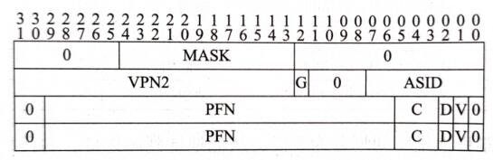

# MMU

## MIPS内存布局

MIPS的虚拟内存分为以下几个部分：

```
|----------------| <- 0xFFFFFFFF
|  Kernel Mapped |
|     (kseg3)    |
|----------------| <- 0xE0000000
|----------------| <- 0xDFFFFFFF
|   Supervisor   |
|     Mapped     |
|     (ksseg)    |
|----------------| <- 0xC0000000
|----------------| <- 0xBFFFFFFF
|     Kernel     |
|    Unmapped    |
|    Uncached    |
|     (kseg1)    |
|----------------| <- 0xA0000000
|----------------| <- 0x9FFFFFFF
|     Kernel     |
|    Unmapped    |
|     cached     |
|     (kseg0)    |
|----------------| <- 0x80000000
|----------------| <- 0x7FFFFFFF
|      User      |
|     Mapped     |
|     (useg)     |
|----------------| <- 0x00000000
```

其中，对于Unmapped段(i.e. **kseg0** and **kseg1**)，我们只需要抹除高三位直接发送到总线即可。

即：
```verilog
assign pa = {3'b000,va[28:0]};
```

这里需要的是，我们需要考虑Cache属性，因为我们运行的程序中可能存在一些IO操作（例如confreg、串口、网卡）等，这些操作如果经过了Cache可能导致一些非预期的行为，且这些操作在使用`lb`、`lh`、`sb`、`sh`等非32位指令的时候，发送到总线上请求的大小需要严格按照这些指令的大小进行。

此外，如果同学们设计超标量处理器，如果要运行操作系统，请务必实现`SYNC`指令以及在MMU输出Uncached时注意多个访存请求需要按序指令。

对于一个基础的MMU（不实现虚拟内存所需要的TLB），只需要实现以下代码即可：

```verilog
module MMU(
    input  [31:0] inst_va,      // instruction virtual address
    input  [31:0] data_va,      // data virtual address

    output [31:0] inst_pa,      // instruction physical address
    output        inst_uncache, // instruction bypass cache
    output [31:0] data_pa,      // data physical address
    output        inst_uncache  // data bypass cache
);

    assign inst_pa = {3'b000,inst_va[28:0]};
    assign inst_uncache = inst_va[29];
    assign data_pa = {3'b000,data_va[28:0]};
    assign data_uncache = data_va[29];

endmodule
```

然后，在I-Cache和D-Cache上，我们需要引入uncache信号，来决定该请求是否通过Cache，防止一些MMIO、DMA以及ID一致性（例如写入指令后执行的场景）的异常。

**不实现TLB的同学阅读到此即可，以下内容留给打算设计TLB的同学们阅读。**

## MIPS软件定义页表

经过计算机组成原理和操作系统课程，相信大家对虚拟内存已经有了一定的了解。

MIPS不同于如今常见的的x86、ARM、RISC-V等架构，这些架构通常通过一个特权寄存器存储一个页表基地址(i.e. **CR3** )，当TLB没有匹配上的时候，CPU硬件会自动根据这个基地址访问页表，如果页表再找不到对应的地址再发生Page Fault例外。

而MIPS处理器通常没有采用这样的设计，它CPU硬件上仅仅提供了一个TLB，当TLB失去匹配时会产生一个例外，并把访问的虚拟地址存入CP0的相关寄存器中，便于软件完成硬件填充页表操作。

### TLB

TLB的作用是供处理器运行在虚拟内存地址时快速完成虚拟地址到物理地址的转换。

而在MIPS架构中，一条TLB条目包括了两个部分，比较部分和翻译部分。

这里值得注意的是，MIPS的TLB表项中，一对相邻的虚拟地址页面被存在同一个表项中，并可以指向不同的物理页面。

例如，如果我们写入该TLB表项的PageMask对应的页面大小是 **4KB** ，那么TLB会根据虚拟地址的`[29:13]`位来匹配到TLB表项，然后根据虚拟地址的`[12]`位是0还是1，来决定使用表项中EntryLo0存储的物理地址还是使用EntryLo1使用的物理地址。

由于相邻的页面通常具有时间局部性和空间局部性，因此这样的设计其实在硬件上可以减小TLB带来的路径长度，减小了硬件为了支持虚拟内存所带来的Overhead。

这里还有一个好处是：相比于一个TLB表项映射一个虚拟页，一个TLB表项映射两个连续的虚拟页，可以在映射两倍的页的情况下，硬件资源仅增加1/3（共享了VPN、MASK、ASID等位域）。



而TLB本身是远远不够的，还需要添加TLB指令，CP0提供相关寄存器来配合，以及实现相关的例外处理逻辑。

### CP0寄存器

为了实现TLB，我们需要在CP0中实现以下寄存器，包括：

**以下寄存器(x,y)表示Register x, Sel y，在大家使用mtc0和mfc0指令的时候将会用到。**

#### EntryLo0(2,0)、EntryLo1(3,0)

| 名称 | 位域 | 描述                                                         | 读/写 | 重置状态 |
| ---- | ---- | ------------------------------------------------------------ | ----- | -------- |
| 0    | 31   | 写时忽略，读时返回0。                                        | 读    | 0        |
| NE   | 30   | 不可执行位                                                   | 读/写 | 未定义   |
| PFN  | 29:6 | Page Frame Number，物理页帧号，也是物理地址的高位（`pa[35:12]`） | 读/写 | 未定义   |
| C    | 5:3  | Cache一致性属性（推荐实现为2代表Uncached，3代表Cacheable）   | 读/写 | 未定义   |
| D    | 2    | Dirty位，用于定义该页面是否可写。                            | 读/写 | 未定义   |
| V    | 1    | Valid，设置为1时说明该TLB表项有效，否则将产生TLB Invalied异常。 | 读/写 | 未定义   |
| G    | 0    | Gloabl位，当它有效时忽略ASID。注意：需要EntryLo0和EntryLo1的G位同时被设置为1时，实际写入的G位才为1，否则为0。 | 读/写 | 未定义   |

#### EntryHi(10,0)

| 名称 | 位域  | 描述                                                         | 读/写 | 重置状态 |
| ---- | ----- | ------------------------------------------------------------ | ----- | -------- |
| VPN2 | 31:13 | 虚拟地址的高位                                               | 读/写 | 未定义   |
| 0    | 12:8  | 写时忽略，读时返回0。                                        | 读    | 0        |
| ASID | 7:0   | 地址空间标识域（用于多个进程可以共享TLB，从而不必在地址空间切换时刷掉整个TLB导致性能开销） | 读/写 | 未定义   |

#### PageMask(5,0)

| 名称 | 位域       | 描述                                                         | 读/写 | 重置状态 |
| ---- | ---------- | ------------------------------------------------------------ | ----- | -------- |
| Mask | 28:13      | 页面掩码，指代页面大小，例如全0表示4KB，`[14:13]`为1其它为0表示16KB，以此类推。 | 读/写 | 未定义   |
| 0    | 31:29,12:0 | 写时忽略，读时返回0。                                        | 读    | 0        |

#### BadVAddr(8,0)

我们在之前已经实现了`AdEL`和`AdES`两种例外，当这两种例外发生时需要将错误的虚拟地址填写到这个寄存器中，当发生TLB相关的3种例外时也是如此。

#### Index(0,0)

| 名称  | 位域                   | 描述                                                         | 读/写 | 重置状态 |
| ----- | ---------------------- | ------------------------------------------------------------ | ----- | -------- |
| P     | 31                     | 0表示上一条TLBP指令找到了对应的TLB表项，1表示没有找到。      | 读    | 未定义   |
| 0     | 30:log2(nr_tlb_entry)  | 写时忽略，读时返回0。                                        | 读    | 0        |
| Index | log2(nr_tlb_entry)-1:0 | TLB的索引号，用于TLBP指令返回找到的TLB表项号以及写入要写入的TLB表项号供TLBWI指令使用。 | 读/写 | 未定义   |

#### Wired(6,0)

读写寄存器。

Wired寄存器用于规定`TLBWR`指令随机替换TLB时的界限，复位时设置为0，表示Random寄存器随机范围的下界（包含）。

#### Random(1,0)

只读寄存器，复位时置为TLB表项数量-1。

用于配合Wired寄存器指示当前随机产生的TLB表项索引号，以供`TLBWR`指令写入使用。

随机的方式由处理器设计自定义，比如可以每个clock+1到达上界再恢复为wired寄存器的值。

#### Context(4,0)

| 名称    | 位域  | 描述                                              | 读/写 | 重置状态 |
| ------- | ----- | ------------------------------------------------- | ----- | -------- |
| PTEBase | 31:23 | 页表基地址，供操作系统使用。                      | 读/写 | 0        |
| BadVPN2 | 22:4  | 当TLB例外发生时，CP0应该写入`va[31:13]`到该寄存器 | 读    | 未定义   |
| 0       | 3:0   | 写时忽略，读时返回0。                             | 读    | 0        |

### TLB指令

#### TLBP

指令格式：

```
31      26 25  24                  6 5      0
|       |   |  |                   | |      |
v       v   v  v                   v v      v
|--------------------------------------------|
|   COP0 | CO |       '0'*19        |  TLBP  |
| 010000 |  1 | 0000000000000000000 | 001000 |
|--------------------------------------------|
```

描述：将CP0的EntryHi寄存器相同的TLB表项地址送入CP0的Index寄存器，并把CP0的Index寄存器的P位设置为0。若无法匹配，则Index寄存器的P位设置为1。

#### TLBR

指令格式：

```
31      26 25  24                  6 5      0
|       |   |  |                   | |      |
v       v   v  v                   v v      v
|--------------------------------------------|
|   COP0 | CO |       '0'*19        |  TLBR  |
| 010000 |  1 | 0000000000000000000 | 000001 |
|--------------------------------------------|
```

描述：根据CP0的Index寄存器读取TLB表项状态到CP0的PageMask、EntryHi、EntryLo0、EntryLo1寄存器。

#### TLBWI

指令格式：

```
31      26 25  24                  6 5      0
|       |   |  |                   | |      |
v       v   v  v                   v v      v
|--------------------------------------------|
|   COP0 | CO |       '0'*19        |  TLBWI |
| 010000 |  1 | 0000000000000000000 | 000010 |
|--------------------------------------------|
```

描述：根据CP0的Index寄存器的值，将PageMask、EntryHi、EntryLo0、EntryLo1写入TLB。

#### TLBWR

指令格式：

```
31      26 25  24                  6 5      0
|       |   |  |                   | |      |
v       v   v  v                   v v      v
|--------------------------------------------|
|   COP0 | CO |       '0'*19        |  TLBWR |
| 010000 |  1 | 0000000000000000000 | 000110 |
|--------------------------------------------|
```

描述：根据CP0的Random寄存器的值，将PageMask、EntryHi、EntryLo0、EntryLo1写入TLB。

### TLB相关例外

#### TLB refill

产生原因：正在访问的虚拟地址TLB没有匹配到（注意，没有匹配不等同Valid Bit没有设置）。

`CP0_status[ExCode]`：TLBL（ExCode=2，Load操作或取指）、TLBS：（ExCode=3，store操作）

额外动作（不含Status、Cause、EPC的常规操作）：

- CP0_BadVAddr<=PC/MEM_Addr
- CP0_Context[BADVPN2]<=PC/MEM_Addr[31:13]
- CP0_EntryHi[VPN2]<=PC/MEM_Addr[31:13]

#### TLB invalid

产生原因：正在访问的虚拟地址TLB匹配成功，但是Valid Bit为0。

`CP0_status[ExCode]`：TLBL（ExCode=2，Load操作或取指）、TLBS：（ExCode=3，store操作）

额外动作（不含Status、Cause、EPC的常规操作）：

- CP0_BadVAddr<=PC/MEM_Addr
- CP0_Context[BADVPN2]<=PC/MEM_Addr[31:13]
- CP0_EntryHi[VPN2]<=PC/MEM_Addr[31:13]

#### TLB Modified

产生原因：写入某个虚拟地址的时候，TLB匹配有效，但是Dirty Bit为0（被保护不可写）。

`CP0_status[ExCode]`：Mod（ExCode=1）。

额外动作（不含Status、Cause、EPC的常规操作）：

- CP0_BadVAddr<=PC/MEM_Addr
- CP0_Context[BADVPN2]<=PC/MEM_Addr[31:13]
- CP0_EntryHi[VPN2]<=PC/MEM_Addr[31:13]

### TLB模块设计

对于实现TLB的MMU，推荐按照以下模板设计：

```verilog
module MMU(
    input  [31:0] inst_va,      // instruction virtual address
    input  [31:0] data_va,      // data virtual address

    output [31:0] inst_pa,      // instruction physical address
    output        inst_uncache, // instruction bypass cache
    output [31:0] data_pa,      // data physical address
    output        inst_uncache, // data bypass cache
    // CP0 in
    input  [31:0] EntryHi_i,
    input  [31:0] PageMask_i,
    input  [31:0] EntryLo0_i,
    input  [31:0] EntryLo1_i,
    input  [31:0] Index_i,
    input  [31:0] Random_i,
    // CP0 out
    output [31:0] EntryHi_o,
    output [31:0] PageMask_o,
    output [31:0] EntryLo0_o,
    output [31:0] EntryLo1_o,
    output [31:0] Index_o,
    // TLB instruction
    input  [6:0]  TLB_instr,    // TLBP,TLBR,TLBWI,TLBWR
    input         clk,
    // TLB flag
    output        inst_match,
    output        data_match,
    output        inst_valid,
    output        data_valid,
    output        data_writeable
);

// 一些reg，定义你的TLB存取方式，如果流水化也可以使用Block Memory。

// 定义TLB相关的组合逻辑

always @(posedge clk) begin
    // 定义TLB指令的处理
end

endmodule
```


## 一些细节

### VIPT Cache

细调过Cache参数的同学们一定注意过，Cache往往出现在影响CPU时序的关键路径上，与此同时若采用PIPT Cache（也就是虚拟地址传给TLB匹配后再把物理地址送入Cache），其匹配时又串上了一个TLB那么必然对频率造成更大的影响。

如果我们每路Cache Index的用到的虚拟地址部分超过了12位，就需要留意这个问题，因此，我们可以使用VIPT的设计。

Virtually Indexed Physically Tagged (VIPT) Cache 是带有MMU的处理器Cache常见的组织形式。在TLB匹配之前用虚拟地址作为Cache的Index，送入TLB进行匹配，这样Cache的匹配就可以与TLB的匹配同步进行，避免TLB的存在过多影响频率。

这里还需要注意一点，若VIPT Cache若采用写回策略，会出现同义问题（synoyms）以及重名（aliasing）问题，即一个物理地址对应了多个虚拟地址，遇到这部分问题读者可以自己思考结合《超标量处理器设计》P79所提的根据物理地址划分Bank的方法来解决，不过考虑到大多数同学造的Cache每一路最多4KB，因此大家在FPGA上实际造机的时候可能很难遇到。

*P.S. 如果硬件综合设计期间时间有限，可以让操作系统全部跑在Uncached地址段来简化一些必要的实现。*

### 分支预测问题

在启用MMU的处理器上若使用了分支预测器，可能导致跳转的位置不在TLB中从而导致TLB例外的情况，这样的做法不符合ISA定义。甚至有可能导致跳转到了无效地址处，继而内核无法处理这个Page Fault，最终导致进程被杀。因此同学们在设计处理器时需要考虑这种情况，如果一定要达成跑通操作系统的目标，可以尝试简化一些提高性能的设计。

此外，学有余力的同学们也可以了解一下Meltdown和Spectre漏洞，了解一下MMU权限管理配合Cache和分支预测器可能带来的侧信道问题，可以思考硬件上如何解决这样的问题，同时对CPU性能的影响尽可能小，特别是信息安全专业将来有志于软硬件协同安全研究的同学。

## 参考资料

[MIPS32 Architecture](https://www.mips.com/products/architectures/mips32-2/)

[The MIPS32 and microMIPS32 Privileged Resource Architecture v5.05](https://www.mips.com/?do-download=the-mips32-and-micromips32-privileged-resource-architecture-v5-05)