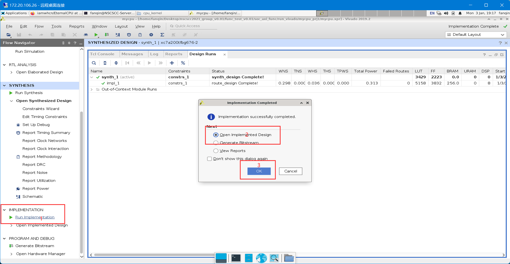
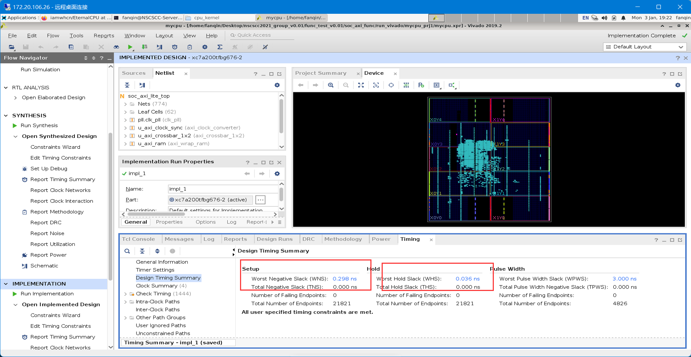
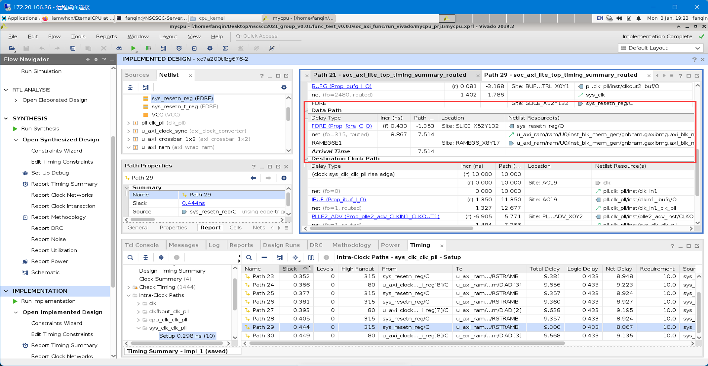

# 性能优化技巧

### 提升频率

####  **CACHE** 部分

####  **数据通路部分** 

+ 关键路径

    - 1.先进行综合
     
      

    - 2.查看WNS，点击WNS
     
      

    - 3.选择关键路径分析
     
      

+ 数据前推优化：在进行数据前推的时候，把流水级后面的数据前推到前面的流水级的时候，我们应该遵循“尽可能早点前推”的原则。也就是说，前推的数据最好是从流水级触发器能立马得出的数据。