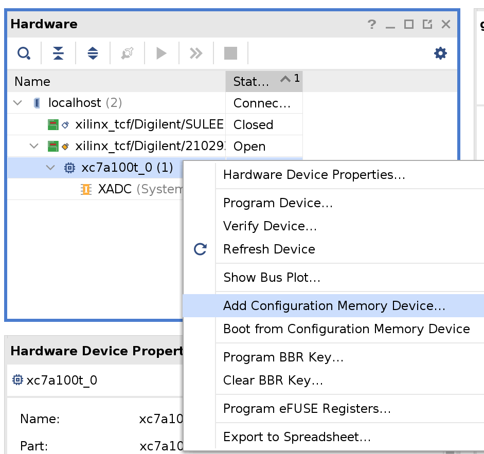
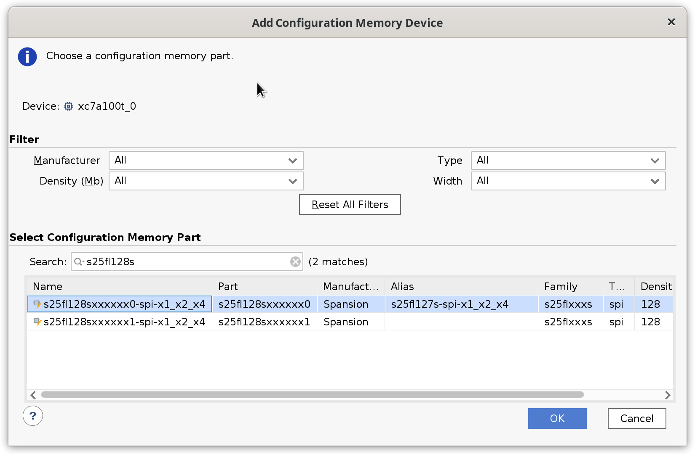
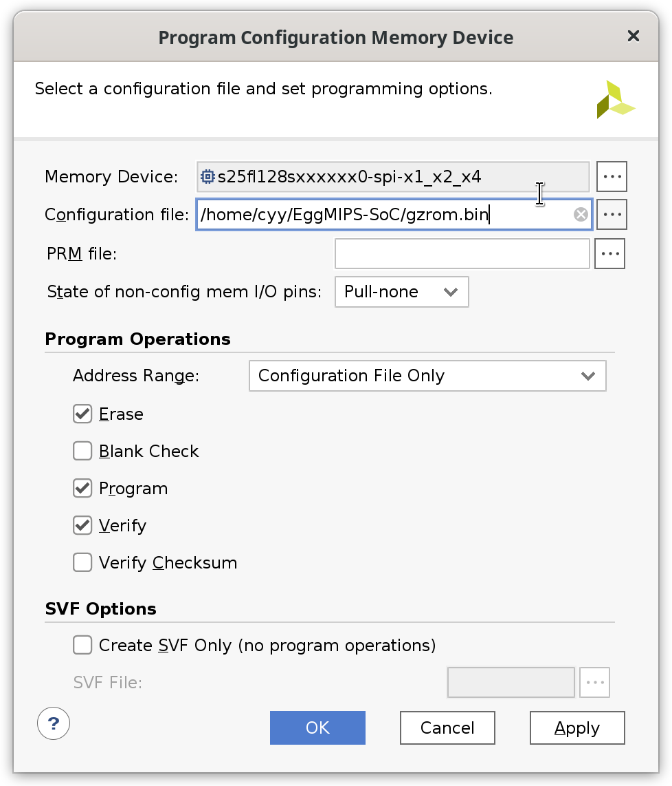
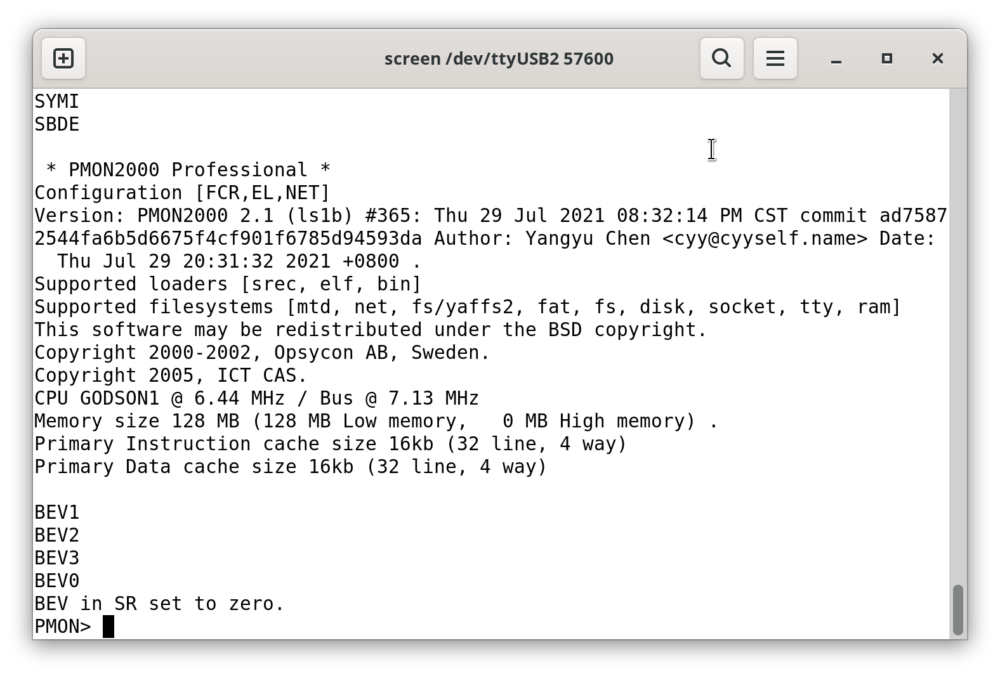

# 运行操作系统

## 需要的资料

移植到N4的运行PMON/OS的SoC：`https://github.com/cyyself/EggMIPS-SoC`

去除NAND简化后的PMON代码：`https://github.com/cyyself/pmon-archlab`

gcc-4.3：`https://mirrors.tuna.tsinghua.edu.cn/loongson/loongson1c_bsp/gcc-4.3/gcc-4.3-ls232.tar.gz`

uCore代码：`https://github.com/cyyself/ucore-thumips`

Linux：可以尝试自己移植主线，自己写设备树等。

一个基本能跑uCore的CPU例子：`https://github.com/cyyself/cpu232`

**注意：运行PMON/OS的SoC需要在Vivado中的Hardware Manager中添加一个Memory Configuration，然后烧入BIOS文件到板上的Flash（该过程具体见N4DDR开发板的说明书），然后使用板子USB连接串口进行操作（默认波特率为57600），做到这一步的同学遇到问题可以联系18级的实验助教。**

使用EggMIPS-SoC上板操作：

1. 烧录BIOS

打开Hardware Manager，在找到的设备上右键，点`Add Configuration Memory Device`。

然后搜索s25fl128s，选择part最后以0结尾的设备。

`Configuration File`选择提供的SoC包中的`gzrom.bin`（这里是一个去除NAND功能的PMON），当然同学们也可以使用PMON源代码自己编译，也可以尝试自己移植uboot等BIOS代码，甚至自研bootloader。

烧完开发板后，使用串口程序打开`/dev/ttyUSBx`（其中x根据实际情况修改），使用波特率57600。显示以下界面说明启动成功，若发现没有输出可以按开发板上的reset按钮。

