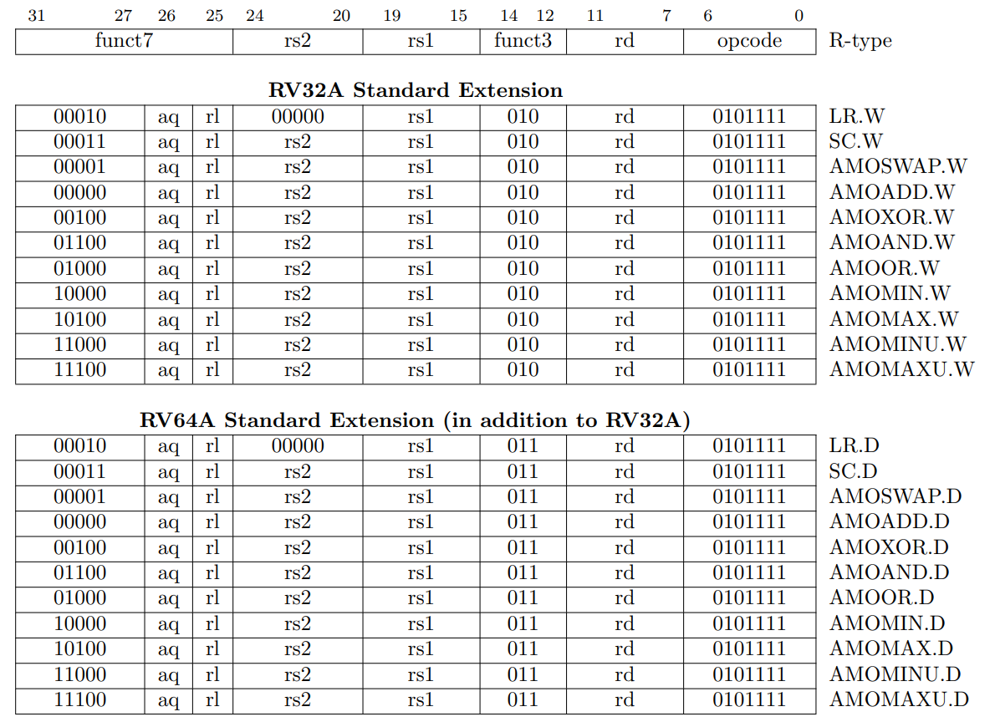
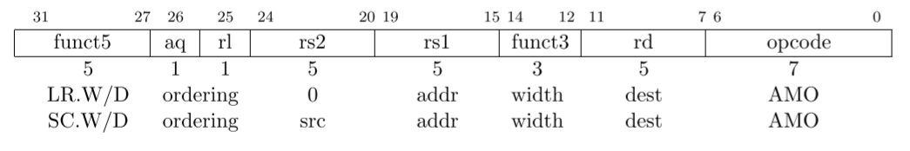
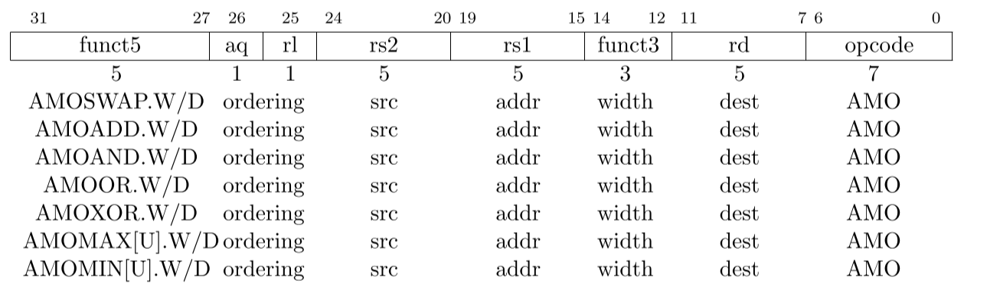

# A扩展

原子指令（Atmoic Instruction）扩展，以支持在进行内存的 read-modify-write 原子操作时，保证同一块内存空间（word/doubleword）的同步。主要有两种类型的原子操作：
- load-reserved/store-conditional: 加载保留/条件存储
- atomic fetch-and-op memory: 内存原子操作，即AMO指令，典型的 read-modify-write。

原子指令具有统一的格式：

> 原子指令和FENCE指令的区别：
RISC-V中，根据执行环境将地址空间划分为内存、IO两个地址域。原子指令智能保证其中的一个顺序访问，而FENCE指令会保证两个地址空间均被顺序访问。

## LR/SC

LR.W/D: load址在GPR[rs1]的内存值，（符号扩展为64-bit后）存入GPR[rd]中，并注册一个 reservation set（地址范围内的字节集合）。
SC.W/S: 有条件地将GPR[rs2]中的值，写入址在GPR[rs1]的内存值，当且仅当 reservation set 仍然有效且包含将要写的所有字时才写。如果写成功，向GPR[rd]写入0；如果写失败，不执行内存写，并向GPR[rd]写入一个非零值。无论是否写成功，将使得这个进程产生的所有 reservation set 无效。

<!-- TODO: -->
<!-- - [x] 指令含义 -->
<!-- - [ ] aq和rl位的说明 -->

## AMO指令

原子性地加载 MEM[ GPR[rs1] ] 的值写入 GPR[rd]；再对MEM[ GPR[rs1] ]和GPR[rs2]执行相应的二进制操作，并将结果存回MEM[ GPR[rs1] ] 中。

对于RV64，32-bit的AMO指令，会将存入rd的值，符号扩展为64-bit，并忽略GPR[rs2]的高32位。

异常：上述两种指令中，GPR[rs1]需要自然对齐到AMO指令的操作数大小（64-bit对应8字节，32-bit对应4字节）。如果没有对齐，则产生“地址未对齐”异常或“访问失败”异常。

