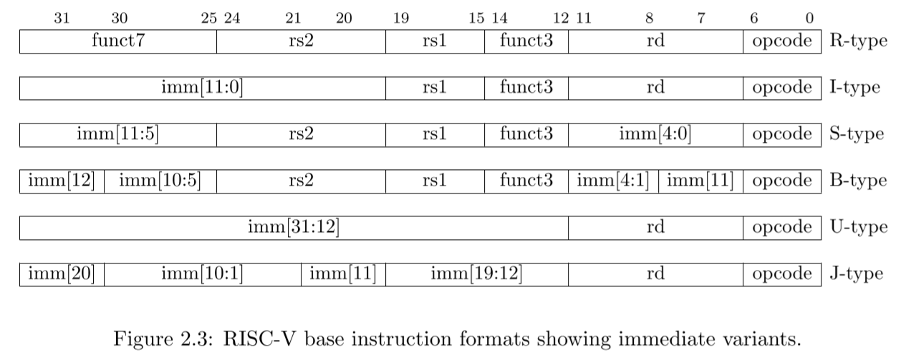

# RV64I: Base Integer Instruction Set

指令基本格式：32位，4字节。

通用寄存器（GPR）：32个，每个可以容纳64位数据。

访存：最多8字节。

## 6种基本指令格式
- R型指令: 用于寄存器-寄存器操作
- U型指令: 用于长立即数
- I型指令: 用于短立即数和访存load操作
- S型指令: 用于访存store操作
- B型指令: 用于条件跳转操作
- J型指令: 用于无条件跳转

如下图所示[^rv-manual-en]：


> S和B型指令的区别在于：
> 1. B型指令的12-bit立即数用于表示跳转偏移量的2倍，故是从imm[1]开始表示。
> 2. S型指令按照指令位顺序表示立即数，而B型指令有一位翻转，即imm[11]。
>
> U和J型指令的区别在于：
> 1. U型指令的imm-bit左移12位构成其立即数，J型指令的imm-bit左移1位构成其立即数。
> 2. J型指令存在多位翻转。

如果你使用Verilog语言，你可以使用以下代码得到RV64指令的立即数和funct：

```verilog
input wire [31:0] instr;

wire [63:0] imm_itype = {{52{instr[31]}},instr[31:20]};
wire [63:0] imm_stype = {{52{instr[31]}},instr[31:25],instr[11:7]};
wire [63:0] imm_btype = {{51{instr[31]}},instr[31],instr[7],instr[30:25],instr[11:8],1'b0};
wire [63:0] imm_utype = {{32{instr[31]}},instr[31:12],12'd0};
wire [63:0] imm_jtype = {{43{instr[31]}},instr[31],instr[19:12],instr[20],instr[30:21],1'b0};

wire   [4:0] rs2    = instr[24:20];
wire   [4:0] rs1    = instr[19:15];
wire   [4:0] rd     = instr[11:7 ];
wire   [6:0] opcode = instr[6:0];
wire   [2:0] funct3 = instr[14:12];
wire   [6:0] funct7 = instr[31:25];
wire   [4:0] funct5 = instr[31:27]; // only used in amo
```

## 推荐阅读

[The RISC-V Instruction Set Manual Volume I: Unprivileged ISA **Chapter 24**](https://riscv.org/wp-content/uploads/2019/06/riscv-spec.pdf)

[CEMU RISC-V Core](https://github.com/cyyself/cemu/blob/master/src/core/riscv/rv_core.hpp)


## 指令概览

RISC-V指令使用低6位表示OPCODE，指令可分为以下几类：

!!! warning

    这里所述的指令种类与前文所述的指令类型意思不同。这里按照OPCODE进行分类。


```sv
typedef enum logic [6:0] {
    OPCODE_LUI      = 7'b0110111,
    OPCODE_AUIPC    = 7'b0010111,
    OPCODE_JAL      = 7'b1101111, // 需要异常处理
    OPCODE_JALR     = 7'b1100111, // 需要异常处理
    OPCODE_BRANCH   = 7'b1100011, // 需要异常处理
    OPCODE_LOAD     = 7'b0000011, // 需要异常处理
    OPCODE_STORE    = 7'b0100011, // 需要异常处理
    OPCODE_OPIMM    = 7'b0010011,
    OPCODE_OPIMM32  = 7'b0011011,
    OPCODE_OP       = 7'b0110011,
    OPCODE_OP32     = 7'b0111011,
    OPCODE_FENCE    = 7'b0001111,
    OPCODE_SYSTEM   = 7'b1110011, // 需要异常处理，没有CSR时可全部实现为空操作
} rv64i_opcode;
```

注：异常处理涉及跳转PC非对齐、访存非对齐、访存总线异常等情况，需要同学们在设计处理器时考虑实现。在初期阶段实现CSR之前，异常处理可暂时不检查。

### OPCODE_LUI

该类指令中只有一条指令，格式如下：

```
+----------------+---------+-------+
|   imm[31:12]   | rd[4:0] |0110111| LUI
+----------------+---------+-------+
 31            12 11      7 6     0
```

将立即数 **符号** 扩展后，存入rd寄存器，`[11:0]`部分填0。

伪代码：
```verilog
wire [63:0] imm_utype = {{32{instr[31]}},instr[31:12],12'd0};

GPR[rd] <= imm_utype;
```

### OPCODE_AUIPC

```
+----------------+---------+-------+
|   imm[31:12]   | rd[5:0] |0010111| AUIPC
+----------------+---------+-------+
 31            12 11      7 6     0
```

将立即数 **符号** 扩展后，**加上PC**，存入rd寄存器，`[11:0]`部分填0。

伪代码：
```verilog
wire [63:0] imm_utype = {{32{instr[31]}},instr[31:12],12'd0};

GPR[rd] <= imm_utype + pc;
```

### OPCODE_JAL

```
+---------------------------+---------+-------+
|   imm[20|10:1|11|19:12]   | rd[5:0] |1101111| 
+---------------------------+---------+-------+
 31                       12 11      7 6     0
```

将立即数 **符号** 扩展后，最低位填0，加上PC，进行跳转。跳转同时将rd寄存器写入当前`PC+4`。

伪代码：
```verilog
wire [63:0] imm_jtype = {{43{instr[31]}},instr[31],instr[19:12],instr[20],instr[30:21],1'b0};

GPR[rd] <= pc + 4;
pc <= pc + imm_jtype;
```

异常：
1. 如果`imm[1]`为1，导致跳转后PC没有4字节对齐，则在 **JAL指令本身** 产生`Instruction address misaligned`异常。（仅限于没有实现RVC的情况）

### OPCODE_JALR

```
+---------------+----------+---+---------+-------+
|   imm[11:0]   | rs1[4:0] |000| rd[4:0] |1100111|
+---------------+----------+---+---------+-------+
 31           20 19      15     11      7 6     0
```

将立即数 **忽略imm[0]** **符号** 扩展后，加上`GPR[rs1]`，进行跳转。跳转同时将rd寄存器写入当前`PC+4`。

伪代码：
```verilog
wire [63:0] imm_itype = {{52{instr[31]}},instr[31:20]};

GPR[rd] <= pc + 4;
pc <= imm_itype + GPR[rs1];
```

异常：
1. 如果最终跳转PC没有对齐4字节（实现了RVC的核为2字节），则在 **JALR指令本身** 产生`Instruction address misaligned`异常。

!!! info

    为什么忽略最低位可以参考[The RISC-V Instruction Set Manual Volume I: Unprivileged ISA Document Version 20191213](https://riscv.org/wp-content/uploads/2019/06/riscv-spec.pdf) Page 21（PDF中的39页）。

### OPCODE_BRANCH（6条指令）

```
+--------------+----------+----------+---------+-------------+-------+
| imm[12|10:5] | rs2[4:0] | rs1[4:0] |BRANCH_OP| imm[4:1|11] |1100011| Branch（根据BRANCH_OP取值不同含6条指令）
+--------------+----------+----------+---------+-------------+-------+
 31          25 24      20 19      15 14     12 11          7 6     0
```

其中，BRANCH_OP取值和对应行为如下（不写`$signed`时默认`unsigned`）：

```verilog
typedef enum logic [2:0] {
    FUNCT3_BEQ  = 3'b000, // 当GPR[rs1] == GPR[rs2]时，跳转
    FUNCT3_BNE  = 3'b001, // 当GPR[rs1] != GPR[rs2]时，跳转
    FUNCT3_BLT  = 3'b100, // 当$signed(GPR[rs1]) <  $signed(GPR[rs2])时，跳转
    FUNCT3_BGE  = 3'b101, // 当$signed(GPR[rs1]) >= $signed(GPR[rs2])时，跳转
    FUNCT3_BLTU = 3'b110, // 当GPR[rs1] <  GPR[rs2]时，跳转
    FUNCT3_BGEU = 3'b111  // 当GPR[rs1] >= GPR[rs2]时，跳转
} funct3_branch;
```

伪代码：

- 判断部分
    ```verilog
    logic branch_taken;
    always_comb
        case(funct3)
            FUNCT3_BEQ:  branch_taken =         GPR[rs1]  ==         GPR[rs2] ;
            FUNCT3_BNE:  branch_taken =         GPR[rs1]  !=         GPR[rs2] ;
            FUNCT3_BLT:  branch_taken = $signed(GPR[rs1])  < $signed(GPR[rs2]);
            FUNCT3_BGE:  branch_taken = $signed(GPR[rs1]) >= $signed(GPR[rs2]);
            FUNCT3_BLTU: branch_taken =         GPR[rs1]  <          GPR[rs2] ;
            FUNCT3_BGEU: branch_taken =         GPR[rs1]  >=         GPR[rs2] ;
            default:     branch_taken = 0;
        endcase
    end
    ```
- 处理器行为：
    ```verilog
    wire [63:0] imm_btype = {{51{instr[31]}},instr[31],instr[7],instr[30:25],instr[11:8],1'b0};

    if (branch_taken)
        pc <= pc + imm_btype;
    end
    ```

异常：
1. 如果最终跳转PC没有对齐4字节（实现了RVC的核为2字节），则在 **Branch指令本身** 产生`Instruction address misaligned`异常。

!!! warning
    
    Branch与JAL/JALR不同的是，Branch指令没有提交当前PC到寄存器。

### OPCODE_OPIMM（9条指令）

指令类型：立即数运算指令

该OPCODE下，指令如下：

```
 31               20
+-------------------+----------+-----+---------+-------+
|     imm[11:0]     | rs1[4:0] | 000 | rd[4:0] |0010011| ADDI
+-------------------+----------+-----+---------+-------+
|     imm[11:0]     | rs1[4:0] | 010 | rd[4:0] |0010011| SLTI
+-------------------+----------+-----+---------+-------+
|     imm[11:0]     | rs1[4:0] | 011 | rd[4:0] |0010011| SLTIU
+-------------------+----------+-----+---------+-------+
|     imm[11:0]     | rs1[4:0] | 100 | rd[4:0] |0010011| XORI
+-------------------+----------+-----+---------+-------+
|     imm[11:0]     | rs1[4:0] | 110 | rd[4:0] |0010011| ORI
+-------------------+----------+-----+---------+-------+
|     imm[11:0]     | rs1[4:0] | 111 | rd[4:0] |0010011| ANDI
+------+------------+----------+-----+---------+-------+
|000000| shamt[5:0] | rs1[4:0] | 001 | rd[4:0] |0010011| SLLI
+------+------------+----------+-----+---------+-------+
|000000| shamt[5:0] | rs1[4:0] | 101 | rd[4:0] |0010011| SRLI
+------+------------+----------+-----+---------+-------+
|010000| shamt[5:0] | rs1[4:0] | 101 | rd[4:0] |0010011| SRAI
+------+------------+----------+-----+---------+-------+
 31  26 25        20 19      15 14 12 11      7 6     0
```

伪代码：
```verilog
wire [63:0] imm_itype = {{52{instr[31]}},instr[31:20]};
wire [5:0] shamt = instr[25:20];

case(funct3)
    000: GPR[rd] <= GPR[rs1] + imm_itype;                           // ADDI
    010: GPR[rd] <= {63'd0,$signed(GPR[rs1]) < $signed(imm_itype)}; // SLTI
    011: GPR[rd] <= {63'd0,        GPR[rs1]  <         imm_itype};  // SLTIU
    100: GPR[rd] <= GPR[rs1] ^ imm_itype};                          // XORI
    110: GPR[rd] <= GPR[rs1] | imm_itype};                          // ORI
    111: GPR[rd] <= GPR[rs1] & imm_itype};                          // ANDI
    001: GPR[rd] <= GPR[rs1] << shamt;                              // SLLI
    101: GPR[rd] <= (
        instr[30] ? ($signed(GPR[rs1]) >>> shamt) :                 // SRAI
                    (        GPR[rs1]   >> shamt)                   // SRLI
    );
endcase
```

### OPCODE_OPIMM-32（4条指令）

指令类型：立即数 **32位** 运算指令。

该OPCODE下，指令如下：

```
 31                20
+--------------------+----------+-----+---------+-------+
|     imm[11:0]      | rs1[4:0] | 000 | rd[4:0] |0011011| ADDIW
+-------+------------+----------+-----+---------+-------+
|0000000| shamt[4:0] | rs1[4:0] | 001 | rd[4:0] |0011011| SLLIW
+-------+------------+----------+-----+---------+-------+
|0000000| shamt[4:0] | rs1[4:0] | 101 | rd[4:0] |0011011| SRLIW
+-------+------------+----------+-----+---------+-------+
|0100000| shamt[4:0] | rs1[4:0] | 101 | rd[4:0] |0011011| SRAIW
+-------+------------+----------+-----+---------+-------+
 31   25 24        20 19      15 14 12 11      7 6     0
```

伪代码：
```verilog
wire [31:0] imm_itype_32 = {{20{instr[31]}},instr[31:20]};
wire [4:0] shamt_32 = instr[24:20];
wire [31:0] rs1_32 = GPR[rs1][31:0]
wire [31:0] GPR_rd_32;

case(funct3)
    000: GPR_rd_32 = rs1_32 + imm_itype_32;             // ADDIW
    001: GPR_rd_32 = rs1_32 << shamt_32;                // SLLIW
    101: GPR_rd_32 = (
        instr[30] ? ($signed(rs1_32) >>> shamt_32) :    // SRAIW
                    (        rs1_32   >> shamt_32)      // SRLIW
    );
endcase
```

### OPCODE_OP（10条指令）

指令类型：寄存器运算指令。

该OPCODE下，指令如下：

```
+-------+----------+----------+-----+---------+-------+
|0000000| rs2[4:0] | rs1[4:0] | 000 | rd[4:0] |0110011| ADD
+-------+----------+----------+-----+---------+-------+
|0100000| rs2[4:0] | rs1[4:0] | 000 | rd[4:0] |0110011| SUB
+-------+----------+----------+-----+---------+-------+
|0000000| rs2[4:0] | rs1[4:0] | 001 | rd[4:0] |0110011| SLL
+-------+----------+----------+-----+---------+-------+
|0000000| rs2[4:0] | rs1[4:0] | 010 | rd[4:0] |0110011| SLT
+-------+----------+----------+-----+---------+-------+
|0000000| rs2[4:0] | rs1[4:0] | 011 | rd[4:0] |0110011| SLTU
+-------+----------+----------+-----+---------+-------+
|0000000| rs2[4:0] | rs1[4:0] | 100 | rd[4:0] |0110011| XOR
+-------+----------+----------+-----+---------+-------+
|0000000| rs2[4:0] | rs1[4:0] | 101 | rd[4:0] |0110011| SRL
+-------+----------+----------+-----+---------+-------+
|0100000| rs2[4:0] | rs1[4:0] | 101 | rd[4:0] |0110011| SRA
+-------+----------+----------+-----+---------+-------+
|0100000| rs2[4:0] | rs1[4:0] | 110 | rd[4:0] |0110011| OR
+-------+----------+----------+-----+---------+-------+
|0100000| rs2[4:0] | rs1[4:0] | 111 | rd[4:0] |0110011| AND
+-------+----------+----------+-----+---------+-------+
 31   25 24      20 19      15 14 12 11      7 6     0
```

注：后续增加乘除法指令时，会共享该OPCODE，通过funct7区分。

伪代码：
```verilog
case(funct3)
    000: GPR[rd] <= (
        instr[30] ? (GPR[rs1] - GPR[rs2]) :                         // SUB
                    (GPR[rs1] + GPR[rs2])                           // ADD
    );
    001: GPR[rd] <= GPR[rs1] << GPR[rs2][5:0];                      // SLL
    010: GPR[rd] <= {63'd0,$signed(GPR[rs1]) < $signed(GPR[rs2])};  // SLT
    011: GPR[rd] <= {63'd0,        GPR[rs1]  <         GPR[rs2]};   // SLTU
    100: GPR[rd] <= GPR[rs1] ^ GPR[rs2]};                           // XOR
    101: GPR[rd] <= (
        instr[30] ? ($signed(GPR[rs1]) >>> GPR[rs2][5:0]) :         // SRA
                    (        GPR[rs1]   >> GPR[rs2][5:0])           // SRL
    );
    110: GPR[rd] <= GPR[rs1] | GPR[rs2]};                           // OR
    111: GPR[rd] <= GPR[rs1] & GPR[rs2]};                           // AND
endcase
```

### OPCODE_OP-32（5条指令）

指令类型：寄存器 **32位** 运算指令。

该OPCODE下，指令如下：

```
+-------+----------+----------+-----+---------+-------+
|0000000| rs2[4:0] | rs1[4:0] | 000 | rd[4:0] |0111011| ADDW
+-------+----------+----------+-----+---------+-------+
|0100000| rs2[4:0] | rs1[4:0] | 000 | rd[4:0] |0111011| SUBW
+-------+----------+----------+-----+---------+-------+
|0000000| rs2[4:0] | rs1[4:0] | 001 | rd[4:0] |0111011| SLLW
+-------+----------+----------+-----+---------+-------+
|0000000| rs2[4:0] | rs1[4:0] | 101 | rd[4:0] |0111011| SRLW
+-------+----------+----------+-----+---------+-------+
|0100000| rs2[4:0] | rs1[4:0] | 101 | rd[4:0] |0111011| SRAW
+-------+----------+----------+-----+---------+-------+
 31   25 24      20 19      15 14 12 11      7 6     0
```

注：后续增加乘除法指令时，会共享该OPCODE，通过funct7区分。

伪代码：
```verilog
wire [31:0] rs1_32 = GPR[rs1][31:0]
wire [31:0] rs2_32 = GPR[rs1][31:0]
wire [4:0] shamt_32 = GPR[rs2][4:0];
wire [31:0] GPR_rd_32;

case(funct3)
    000: GPR_rd_32 = (
        instr[30] ? rs1_32 - rs2_32 :               // SUBW
                    rs1_32 + rs2_32;                // ADDW
    );
    001: GPR_rd_32 = rs1_32 << shamt_32;            // SLLW
    101: GPR_rd_32 = (
        instr[30] ? ($signed(rs1_32) >>> shamt_32) :// SRAW
                    (        rs1_32   >> shamt_32)  // SRLW
    );
endcase
```

### OPCODE_LOAD（7条指令）

指令类型：内存读指令。

该OPCODE下，指令如下：

```
+-------------------+----------+-----+---------+-------+
|     imm[11:0]     | rs1[4:0] | 000 | rd[4:0] |0000011| LB
+-------------------+----------+-----+---------+-------+
|     imm[11:0]     | rs1[4:0] | 100 | rd[4:0] |0000011| LBU
+-------------------+----------+-----+---------+-------+
|     imm[11:0]     | rs1[4:0] | 001 | rd[4:0] |0000011| LH
+-------------------+----------+-----+---------+-------+
|     imm[11:0]     | rs1[4:0] | 101 | rd[4:0] |0000011| LHU
+-------------------+----------+-----+---------+-------+
|     imm[11:0]     | rs1[4:0] | 010 | rd[4:0] |0000011| LW
+-------------------+----------+-----+---------+-------+
|     imm[11:0]     | rs1[4:0] | 110 | rd[4:0] |0000011| LWU
+-------------------+----------+-----+---------+-------+
|     imm[11:0]     | rs1[4:0] | 011 | rd[4:0] |0000011| LD
+-------------------+----------+-----+---------+-------+
 31               20 19      15 14 12 11      7 6     0
```

处理器行为：

- 使用`GPR[rs1]`+ **有符号** 扩展imm得到访存地址，从该地址读取一定宽度的数据。

- 其中，B表示1字节，H表示2字节，W表示4字节，D表示8字节，访存宽度以这个决定。

- 在符号扩展上，U后缀指令高位填0，不带U后缀指令则按Load大小的最高位进行符号扩展（例如LB就在取得数据的第7位符号扩展）。

异常处理：

1. 如果CPU不支持非对齐访存（建议做不支持的CPU，以降低Cache设计难度），在`访存地址 % 访存宽度 ！= 0`时，产生`Load address misaligned`异常，交给操作系统/SBI完成非对齐访存拆分。

2. 如果总线支持总线错误（例如AXI总线上出现rresp不为OKEY），则产生`Load access fault`异常。

    （不实现的同学可以自己魔改riscv-tests，这部分不做要求）

3. 如果支持PMP、MMU、Hypervisor，则还可能产生`Load page fault`、`Load guest-page fault`，或因PMP产生`Load access fault`，这部分请自行阅读手册。

### OPCODE_STORE（4条指令）

指令类型：内存写指令。

该OPCODE下，指令如下：

```
+-----------+----------+----------+-----+----------+-------+
| imm[11:5] | rs2[4:0] | rs1[4:0] | 000 | imm[4:0] |0100011| SB
+-----------+----------+----------+-----+----------+-------+
| imm[11:5] | rs2[4:0] | rs1[4:0] | 001 | imm[4:0] |0100011| SH
+-----------+----------+----------+-----+----------+-------+
| imm[11:5] | rs2[4:0] | rs1[4:0] | 010 | imm[4:0] |0100011| SW
+-----------+----------+----------+-----+----------+-------+
| imm[11:5] | rs2[4:0] | rs1[4:0] | 011 | imm[4:0] |0100011| SD
+-----------+----------+----------+-----+----------+-------+
 31       25 24      20 19      15 14 12 11       7 6     0
```

处理器行为：

- 使用`GPR[rs1]`+ **有符号** 扩展imm得到访存地址，向该地址存储`GPR[rs2]`从低位开始一定宽度的部分。

- 其中，B表示1字节，H表示2字节，W表示4字节，D表示8字节，存储宽度以这个决定。

异常处理：

1. 如果CPU不支持非对齐访存（建议做不支持的CPU，以降低Cache设计难度），在`访存地址 % 访存宽度 ！= 0`时，产生`Store/AMO address misaligned`异常，交给操作系统/SBI完成非对齐访存拆分。

2. 如果总线支持总线错误（例如AXI总线上出现bresp不为OKEY），则产生`Store access fault`异常。

    （不实现的同学可以自己魔改riscv-tests，这部分不做要求）

3. 如果支持PMP、MMU、Hypervisor，则还可能产生`Store/AMO page fault`、`Store/AMO guest-page fault`，或因PMP产生`Store access fault`，这部分请自行阅读手册。

### OPCODE_FENCE（1条指令）

指令类型：内存屏障指令。

对于五级流水不带Cache的核，可以在译码阶段遇到该OPCODE直接实现为NOP。

注：后续实现Cache后，实现的Zifence.i与该指令共享OPCODE，这一部分将在Cache具体介绍。

### OPCODE_SYSTEM（2条指令）

RV64I定义了以下两条指令：

- ECALL

- EBREAK

对于还未实现CSR的核，可以在译码阶段遇到该OPCODE直接实现为NOP。

## 实现建议

由于RISC-V相同OPCODE的指令集功能十分类似，推荐在Verilog语言中使用`case`语句按照OPCODE区分指令，完成译码器编写。

## 常见问题

1. 如果对于某一种指令，其funct部分未用全，出现OPCODE有效而指令无效怎么办，是否一定要产生异常？

    尽管这么做不符合规定，但RISC-V Tests不包含这一部分的测试，因此对于简单实现可以考虑不检查。但对于FUNCT_SYSTEM强烈建议进行严格检查。

2. 对于带立即数的移位指令，其funct部分如果其他位出现了1，是否一定要产生异常？

    尽管这么做不符合规定，但RISC-V Tests不包含这一部分的测试，因此对于简单实现可以考虑不检查。

## 异常处理相比MIPS的区别：

1. RISC-V没有运算指令异常，MIPS有Overflow异常。
2. MIPS所有的分支/跳转指令异常发生在分支/跳转之后取指时产生，RISC-V对于取指非对齐异常必须产生在分支/跳转指令本身。（即写入CSR的mepc寄存器是Branch/Jump本身的地址）
3. RISC-V当支持压缩指令扩展时，PC允许对齐2字节而不是4字节，此时跳转指令的取指非对齐异常检查需要相应发生变化。

## 容易犯错的点

1. 32位操作与64位操作将导致不同的行为，建议将操作是32位还是64位传入ALU进行判断，在输入输出都进行32位符号扩展并不等价（例如移位指令的位数，后续的M扩展的乘法指令等）。
2. 对于移位shamt来源寄存器而非立即数的移位指令，其shamt部分对于64位和32位分别是6位和5位。
3. JALR指令记得忽略立即数的最低位
4. Branch不将PC+4写入`GPR[rd]`，只有JAL与JALR这么做。

<!-- TODO: 

例如amo指令、csr指令 部分不满足6大类型

分支预测的一个Trick。Return Address Stack
-->

[^rv-manual-en]: The RISC-V Instruction Set Manual Volume I: Unprivileged ISA (Document Version 20191214-draft)
[^rv-manual-zh]: RISC-V 手册，包云岗，勾凌睿等
