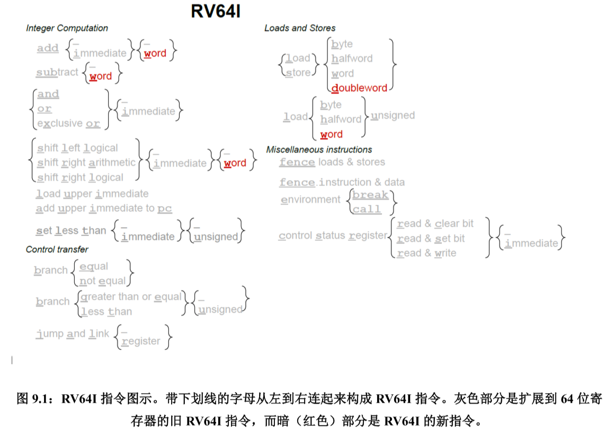

# RV64I: Base Integer Instruction Set

## 6种基本指令格式
- R型指令: 用于寄存器-寄存器操作
- U型指令: 用于长立即数
- I型指令: 用于短立即数和访存load操作
- S型指令: 用于访存store操作
- B型指令: 用于条件跳转操作
- J型指令: 用于无条件跳转

如下图所示[^rv-manual-en]：

> S和B型指令的区别在于：
> 1. B型指令的12-bit立即数用于表示跳转偏移量的2倍，故是从imm[1]开始表示。
> 2. S型指令按照指令位顺序表示立即数，而B型指令有一位翻转，即imm[11]。
>
> U和J型指令的区别在于：
> 1. U型指令的imm-bit左移12位构成其立即数，J型指令的imm-bit左移1位构成其立即数。
> 2. J型指令存在多位翻转。

## 指令概览

基本整数指令中，主要包含：
1. 整数运算指令
2. 控制转移指令
3. 访存指令
4. 内存序指令
5. 环境调用和断点指令
6. HINT指令

RI64I指令图示如下[^rv-manual-zh]:

> RV32I 和 RV64I 的区别：
> 1. 整数寄存器拓宽为64位，即是说：寄存器堆、参与计算的操作数均为64位。
> 2. 支持64位的用户地址空间，即是说：PC为64位，访存地址为64位。

<!-- TODO: 分开陈述各类指令 -->
<!-- ### 1. 整数运算指令 -->

<!-- TODO: branch和jump的异常 

i.e. branch和jump跳转的pc%4!=0（若支持rvc则是pc%2!=0）的时候，异常处理的epc必须是branch/jump指令本身，而不能是跳了之后再trap一个取指异常

例如amo指令、csr指令 部分不满足6大类型

分支预测的一个Trick。Return Address Stack
-->

[^rv-manual-en]: The RISC-V Instruction Set Manual Volume I: Unprivileged ISA (Document Version 20191214-draft)
[^rv-manual-zh]: RISC-V 手册，包云岗，勾凌睿等
