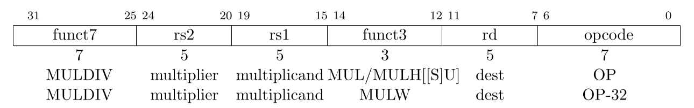
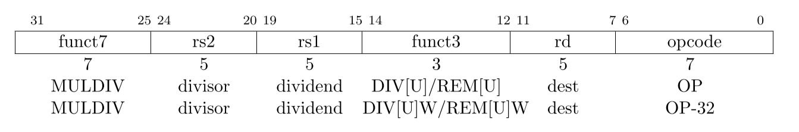
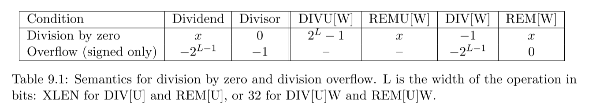

# M扩展

定义了整数乘除法指令扩展（M扩展）的标准。大家也可以自己读[The RISC-V Instruction Set Manual Volume I: Unprivileged ISA **Chapter 7**](https://riscv.org/wp-content/uploads/2019/06/riscv-spec.pdf)。

## 整数乘法


### MUL

```asm
res = GPR[rs1] * GPR[rs2]
GPR[rd] = res[XLEN-1:0]
```

注：两个GPR为64位的情况下，MUL指令得到乘法后低64位的结果。

### MULH\[\[S][U]]

MULH中的H表示High，即取结果的高位的意思，对于RV64，高位取乘法结果共128位中，`[127:64]`的部分。

U表示无符号乘法（请自己思考有符号和无符号的区别）。

SU表示左边操作数（rs1）取有符号，右操作数（rs2）取无符号，用于乘法拆分。

```asm
res = 
    MULH: signed(GPR[rs1]) * signed(GPR[rs2])
    MULHU: unsigned(GPR[rs1]) * unsigned(GPR[rs2])
    MULHSU: signed(GPR[rs1]) * unsigned(GPR[rs2])
GPR[rd] = res[2*XLEN-1:XLEN]
```

### MULW

RV64指令，将源寄存器的低32位相乘，得到的64位结果，符号扩展低32位。

```asm
res = GPR[rs1][31:0] * GPR[rs2][31:0]
GPR[rd] = sign-extension(res[31:0])
```

### 指令融合

当软件要得到128位的乘法结果时，往往会使用MUL+MULH的指令序列，这个时候可以考虑在乘法器硬件上保留上次运算的完整128位结果，如果操作数和操作类型都相同，仅有`H`不同，则直接输出，这样做性能会有些许优化。

## 整数除法


### DIV[U]
用寄存器 (**u**n)signed x[rs1] 的值除以寄存器 (**u**n)signed x[rs2] 的值，向零舍入，把商写入 x[rd] 。

DIV、DIVU分别对应计算结果的 signed 和 unsigned。

### REM[U]
用寄存器 (**u**n)signed x[rs1] 的值除以寄存器 (**u**n)signed x[rs2] 的值，向零舍入，把余数写入 x[rd] 。

REM中余数的符号和被除数rs1相同。

### DIV[U]W / REM[U]W
RV64指令，将源寄存器的(**u**n)signed 低32位相除，得到的32位结果，符号扩展为64位结果，写入 x[rd] 中。

### 指令融合

当软件要得到128位的乘法结果时，往往会使用DIV+REM的指令序列，这个时候可以考虑在除法器硬件上保留上次运算的结果和余数，如果下一次出现的指令仅有DIV/REM不同，是否Unsigned以及是否32位相同，则直接从保存的结果输出，这样做性能会有些许优化。

### 特殊情况处理

1. 除以0
商 = 全1
余数 = 被除数

2. 有符号除法溢出
商 = 被除数
余数 = 0

> **注意：没有除零异常。**
要测试除数是否为零，只需要在除法操作之前加入一条用于测试的 beqz 指令。RV32I 不会因为除零操作而 trap，因为极少数程序需要这种行为，而且在那些软件中可以很容易地检查是否除零。当然，除以其它常数永远不需要检查。