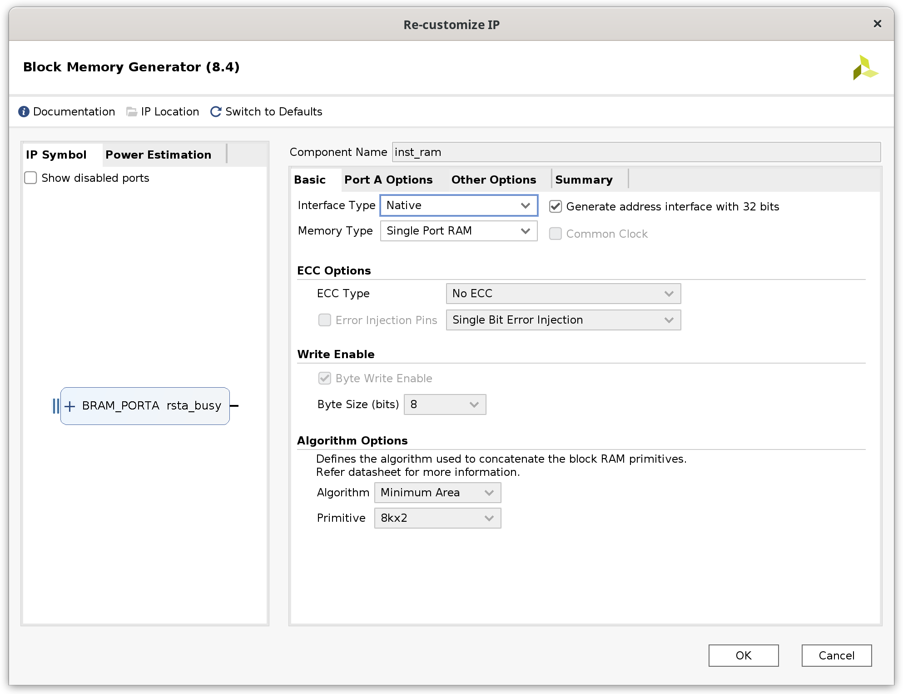
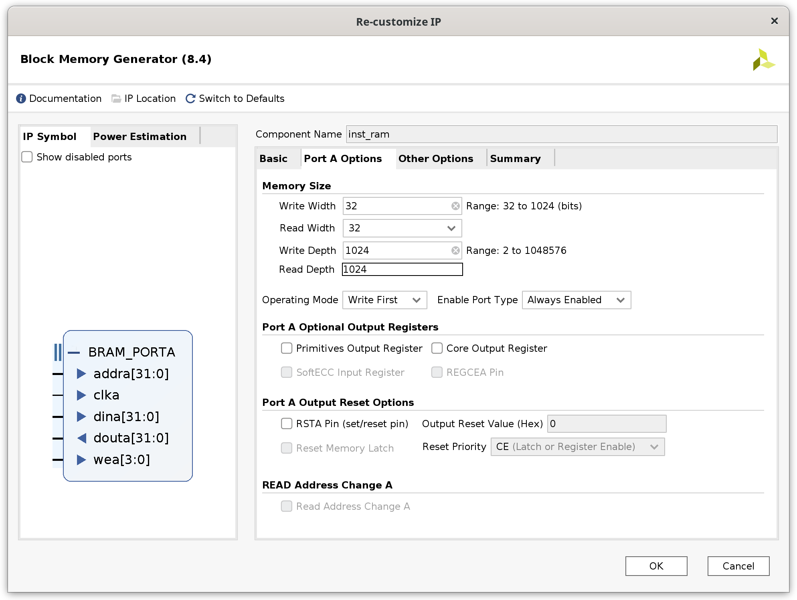
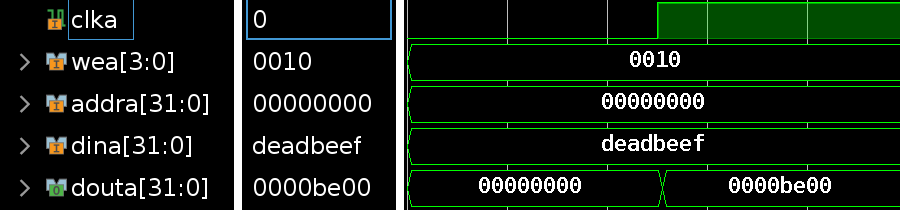
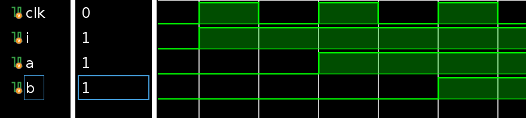
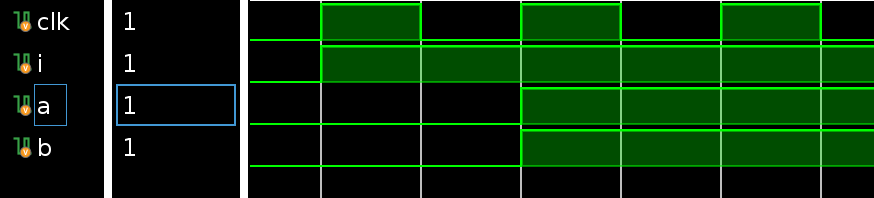
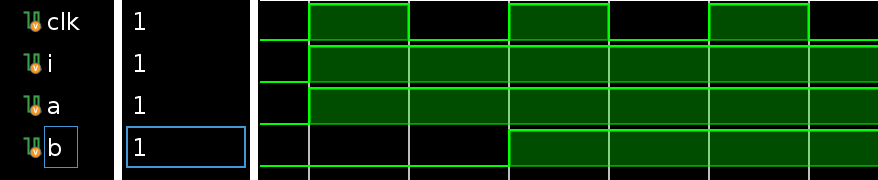

# 常见问题

## 0. Vivado运行卡死

[解决方法在此](https://blog.csdn.net/yihuajack/article/details/120830612)

## 1. iram/dram在多次IP核升级后出现离奇问题（Lab4）

解决方法：删除IP核，并按照以下设置重新设置存储器：





之后在Other Options中载入coe即可。

还需要注意的是，如果Lab4使用老版本的文件，建议把top文件中inst_ram和data_ram连接改为以下形式（注意保留你的时钟取反方式）：

```sv
inst_ram inst_ram
(
    .clka  (clk             ),   
    .wea   (4'd0            ),
    .addra (cpu_inst_addr   ),
    .dina  (32'd0           ),
    .douta (cpu_inst_rdata  ) 
);

data_ram data_ram
(
    .clka  (clk                 ),   
    .wea   (cpu_data_wea        ),
    .addra (cpu_data_addr       ),
    .dina  (cpu_data_wdata      ),
    .douta (cpu_data_rdata      ) 
);
```

这里还需要注意的是，Lab4中我们没有实现按位写入，这里我们需要将wen扩展成4位的wea，来控制每4字节的写入情况。

## 2. 跳转指令测试通过，但跑功能测试炸一片

这个细节卓越班上课有提到过，可以先看看资料包里最近更新的卓越班上课PPT，为了提高大家有限时间内的开发效率，推荐大家把跳转指令从LAB4的ID阶段移动到MEM阶段。因为我们在后续57条指令的时候一样要处理精确异常的跳转，因此这么做其实不会增加工作量，反而可以减少很多跳转指令在ID阶段可能遇到但LAB4没有考虑的坑。

## 3. Load/Store指令的地址及对齐问题

在做52条指令的时候，同学们往往会想到，Load/Store指令都是用字节地址，若lw/sw指令访问的内存地址没有对齐4字节、lh/sh指令访问的内存地址没有对齐2字节的情况如何处理。

在SRAM接口（也就是LAB4的Block memory）中，由于一次访问都是32字节，所以我们需要把访存地址按照32字节处理。对于lh、lb指令，我们需要把这些指令 **低2位** 清除，然后把该地址发给sram接口，再根据地址的 **低2位** 决定读取哪一个字节/半字。对于sh、sb指令，我们需要通过wea来控制写入的字节属于哪一位。

这里需要注意的是，我们设计的处理器采用的是 **小端序**，也就是高位放在低地址中（卓越班的同学在做计网项目时应该很熟悉这个问题，与网络上的大端序刚好相反）。

这里用一张图的时序演示该过程：



在类SRAM接口（AXI转接桥使用的接口）中，可以参阅[类SRAM接口文档](/basic/basic_cache/#sram)。

这里应该会有同学提出疑问，若访问的地址跨越了2个32字节怎么办？这里其实我们在57条指令的时候是需要去做异常处理的，MIPS标准规定了`lw`/`sw`对齐4字节，`lh`/`sh`对齐2字节，且52条指令中其实不会出现这样的情况，可以当作一个未定义行为随意处理。

## 4. 同时触发的非阻塞赋值引用另一个非阻塞赋值，结果是如何传递的？

有的同学可能不知道stall和flush是单个周期生效还是下个周期生效，特别是自己测试的时候还出现了不同位置的信号生效需要等待的周期数不同的问题，这里实际上和这个信号的来源与时钟的关系有关。

该问题本质上是，两个同时触发的非阻塞赋值的reg存在引用时，他们执行顺序的问题，特别是该问题在波形图上是难以看出的。

归纳总结如下：

- 如果来源 **存在** 阻塞赋值，那么它采用的是阻塞赋值结束后的结果。
- 如果来源 **只有** 非阻塞赋值，那么采用的是非阻塞赋值之前的结果。
- 如果在组合逻辑（即`always @(*)`和`always_comb`）中使用非阻塞赋值，其本质和阻塞赋值没有区别。（请注意尽量不要产生锁存器。）

*注：以下的i是一个由posedge的时钟沿控制的信号，因此会慢一个周期。*

```sv
wire i;
reg a, b;
always_ff @(posedge clk) begin
    if (i)  a <= 1'b1;
    else    a <= 1'b0;
end

always_ff @(posedge clk) begin
    if (a)  b <= 1'b1;
    else    b <= 1'b0;
end
```

下图为上方代码仿真结果：



```sv
wire i;
reg a, b;
always_ff @(posedge clk) begin
    if (i)  a = 1'b1; // 相比上图，这里从<=（非阻塞赋值），变成了=（阻塞赋值）
    else    a = 1'b0;
end

always_ff @(posedge clk) begin
    if (a)  b <= 1'b1;
    else    b <= 1'b0;
end
```

下图为上方代码仿真结果：



```sv
wire i;
reg a, b;
always_comb begin // 相比上图，这里换成了组合逻辑（always_comb和always @(*)等价）
    if (i)  a <= 1'b1; // 这里换成=结果相同
    else    a <= 1'b0;
end

always_ff @(posedge clk) begin
    if (a)  b <= 1'b1;
    else    b <= 1'b0;
end
```

下图为上方代码仿真结果：



经过以上实验可以看出，同学们在流水线每一级内部，若写posedge clk，后续用非阻塞赋值，且信号的来源于一个非阻塞赋值（例如每一级之间的触发器），则相当于是使用时钟上升沿之前的结果（比如在E阶段这么写，实际上就是M阶段进行的执行；而在M阶段这么写，实际上也就是WB阶段进行的执行。）。

因此，同学们在使用stall和flush信号的时候需要注意这个问题，否则可能出现波形图中看不出某个信号的这一特征导致一些非预期的情况。

## 5. Vivado xpr无法在Windows下双击打开

[解决方法在此](https://blog.csdn.net/weixin_42837669/article/details/112854020)

## 6. 上板时hw_server打不开（Windows）

如果你的Windows中有安装Hyper-V，可能是其占用的端口范围过大导致hw_server无法监听端口导致。

这种情况可以先按`Windows`+`X`，然后选择`Powershell （管理员）`，首先使用以下命令查看端口占用情况：

```powershell
netsh interface ipv4 show dynamicport tcp
```

如果发现Start Port非常小（如1024），这时候可以修改保留端口范围：

```powershell
netsh int ipv4 set dynamicport tcp start=49152 num=16384
```

然后重启电脑应该可以解决问题。

## 7. Lab4标准代码里的controller.v中equalD是哪里来的？

这里是一个标准代码错误，这里的equalD应该是input，由datapath中的eqcmp得到的。