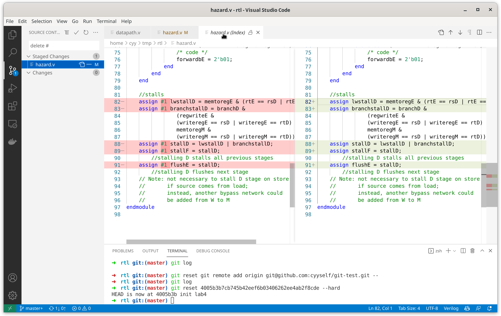

# 简易Git+VSCode使用教程

## 简介

Git是一个版本控制工具，可以方便同学们实现代码的 **版本管理** 便于同学们回顾某个时间的代码修改相比上一个版本做了哪些操作，以及 **多人协作** 的时候可以知道哪些代码是谁改的，为什么要改这部分代码，方便在多人协作然后合并遇到冲突的时候根据历史记录选择出恰当的合并方式。

## 安装Git

下载地址：[https://git-scm.com/](https://git-scm.com/)

## 初始化Git

由于Vivado工程中会存储大量综合、实现后的文件，这些文件是我们源代码的产物，通常没有必要存放在git上。

因此，Git也提供了忽略文件的功能，我们可以创建`.gitignore`文件来指定忽略该文件夹下的文件。

但是，对于Vivado工程来说，需要忽略的内容太多太多，因此更加建议同学们使用的方法是， **只对存放RTL的文件夹使用git** 。

而对于IP核，比较推荐的做法是只放`.xci`文件，或者完全不放， **千万不要放整个IP核的文件夹** ，并确保需要初始化的block memory的coe文件放在所有组员电脑上的相同的相对位置。

我们进入rtl的文件夹，然后打开命令行（Windows用户可以点右键，然后Git Bash），输入以下命令：

```bash
$ git init
hint: Using 'master' as the name for the initial branch. This default branch name
hint: is subject to change. To configure the initial branch name to use in all
hint: of your new repositories, which will suppress this warning, call:
hint: 
hint: 	git config --global init.defaultBranch <name>
hint: 
hint: Names commonly chosen instead of 'master' are 'main', 'trunk' and
hint: 'development'. The just-created branch can be renamed via this command:
hint: 
hint: 	git branch -m <name>
Initialized empty Git repository in /home/cyy/tmp/rtl/.git/
```

在`git init`后，这个文件夹就创建好了。

## 使用VSCode管理Git操作

VSCode自带了一个非常简单易用的git图形界面，建议大家安装VSCode。

## 把硬综已有的rtl文件加入

我们把硬综已有的rtl复制到刚刚执行过`git init`的文件夹中，然后用vscode打开这个文件夹，这里可以看到git处已经出现了多个我们刚刚加入的文件，我们首先点击右键，选择`Stage Changes`。


接着，可以看到这些文件变成了`Staged Changes`，我们需要写一段commit message，这段message也用于我们之后简单描述我们这次commit做了哪些修改，增加了什么功能，修复了什么bug等。


这里我写下了`init lab4`，然后点击上面的打钩图标commit，就完成了一次commit。

首次commit可能会要求你配置邮箱和用户名，这里我们可以在主目录（Windows用户就是C:\Users\你的用户名\）下创建一个.gitconfig文件，然后采用以下格式设置：

```txt
[user]
	email = 2019xxxx@cqu.edu.cn
	name = YOUR NAME
```

这里邮箱推荐填写注册Github、Gitee的邮箱，这样push的时候可以与相应用户绑定。

## 查看git历史

我们可以在本地使用`git log`命令查看当前文件夹下的git历史，可以看到commit记录。

这里需要提醒同学们注意的是，git每次增量修改即使之后删除也会保留，因此同学们切记不要在git仓库中上传一些隐私数据，例如做Web开发时可能会有的各种API的密钥。

```bash
$ git log

commit 4005b3b7cb745b42eef6b03406262ee4ab2f8cde (HEAD -> master)
Author: Yangyu Chen <cyy@cyyself.name>
Date:   Sun Jan 2 04:28:50 2022 +0800

    init lab4
(END)
```

## 在Github、Gitee上创建仓库

在对应网站上操作即可。他们都可以在注册账号后，在主页右上角找到`+`号。

创建好仓库后，这些网站通常会提供一个仓库的URL。该URL也通常分为HTTPS和SSH，使用SSH需要大家自己创建一对非对称密钥。而SSH的优点是比HTTPS要快上很多。

在创建仓库后，我们需要在本地设置url，例如平台告诉我仓库的地址是`git@github.com:cyyself/git-test.git`，可以进行以下操作：

```bash
git remote add origin git@github.com:cyyself/git-test.git
```

注意，这里的origin只是指代这个URL的别名，可以随意更改，一个本地仓库也可以添加多个remote，例如你想在github和gitee上共享一个仓库，就可以用这种方法，使用不同的别名添加两个。

## 上传远程

在设置好远程URL后，我们可以使用`git push -u 远程别名 分支名`来进行上传。

例如我想把master分支上传到远程origin，可以这么写：

```bash
git push -u origin master
```

这里可能需要大家输入用户名和密码，如果觉得每次输入密码麻烦可以配置SSH密钥。

## 后续操作

之后每次修改代码，我们可以用以下步骤完成同步：

1. 修改代码，保存到我们的文件夹
2. 在VSCode中的Git插件浏览代码修改
3. 在VSCode中挑选需要commit的文件（通常是全部），然后编写commit message，完成commit
4. 使用`git push`命令完成上传。



## 下载远程

先保证当前没有Uncommited changes，若有请先commit，或至少可以确保当前修改不会和远程修改有相同的文件，然后使用命令：

```bash
git pull
```

但是这里需要注意的是，如果本地分支与远程修改存在冲突，直接合并会存在问题，这里我们可能需要手动merge。

如果可以自动merge时，有时候git会自动打开VIM让我们填写Commit Message，第一次接触的同学只需要知道：按`i`编辑，按`esc`退出编辑模式，退出编辑模式后可以打`:wq`退出，或者`:q!`不保存退出。

而不能自动merge时，可能出现以下情况：

```bash
$ git pull
hint: You have divergent branches and need to specify how to reconcile them.
hint: You can do so by running one of the following commands sometime before
hint: your next pull:
hint: 
hint:   git config pull.rebase false  # merge (the default strategy)
hint:   git config pull.rebase true   # rebase
hint:   git config pull.ff only       # fast-forward only
hint: 
hint: You can replace "git config" with "git config --global" to set a default
hint: preference for all repositories. You can also pass --rebase, --no-rebase,
hint: or --ff-only on the command line to override the configured default per
hint: invocation.
fatal: Need to specify how to reconcile divergent branches.
```

这个时候我们可以敲命令：

```bash
git merge origin/master
```

即将当前分支和远程分支master合并，此时将会打开文本编辑器写commit message，自己修改或者保持默认均可。

最后结果如下：

```
$ git merge origin/master
Merge made by the 'ort' strategy.
 hazard.v | 10 +++++-----
 1 file changed, 5 insertions(+), 5 deletions(-)
```

而当修改出现冲突的时候，就会在文件里留下不同的commit的两种修改，这时候我们可以在VSCode内操作，来选择我们需要保留哪一个，或进行自主修改，然后完成commit。


## Branch概念

在一个Git仓库中有很多个分支(Branch)，在我们`git init`以后默认会创建一个`master`分支。通常在多人协作中，我们每个人创建各自不同的branch，并在各自的branch上完成自己的分工内容。

- 我们可以使用以下命令基于当前分支创建一个新分支：

	```bash
	git checkout -b 新分支名
	```

- 可以使用以下命令查看已有分支：

	```bash
	git branch -a
	```

- 可以使用以下命令切换分支：

	```bash
	git checkout 分支名
	```

- 分支间合并

	例如，Alice创建了一个名为alice的分支，Bob创建了一个名为bob的分支，Alice合并自己与Bob的修改然后提交到master分支过程如下：

	1. Alice使用`git branch`查看自己当前的分支。（使用oh-my-zsh的同学可以使用git插件）若不是`alice`则执行`git checkout alice`
	2. Alice执行`git pull`下载远程分支，也包括了Bob的分支。这里也可以使用`git fetch origin/bob`。
	3. Alice执行`git merge origin/bob`完成与Bob分支的合并。顺利的话可以直接合并，不顺利则按照前文所述操作。
	4. Alice执行`git checkout master`，进入master分支。
	5. Alice执行`git merge alice`将Alice分支合入master分支，完成一切。
	6. Alice执行`git push -u origin master`将主分支上传到远程服务器。
	7. Alice可选执行`git push -u origin alice`将自己分支上传到远程服务器。

	而另一边的Bob，若希望得到Alice合并后的结果，过程如下：
	1. Bob执行`git pull`下载远程分支。
	2. Bob执行`git merge origin/master`合并Alice对master分支的修改给自己的分支。
	3. Bob可选执行`git push -u origin bob`将自己分支上传到远程服务器。

## 查阅历史记录

这里大家可以在本地安装GUI工具，例如`GitAHead`，也可以直接在托管平台如`GitHub`和`Gitee`网页上查看。

当我们需要在本地直接使用某个历史版本时，可以先通过`git log`查看对应版本的Hash，也可以在托管平台上点击commit得到，然后使用：


例如，假设`git log`输出如下：

```bash
$ git log

commit 4005b3b7cb745b42eef6b03406262ee4ab2f8cde (HEAD -> master)
Author: Yangyu Chen <cyy@cyyself.name>
Date:   Sun Jan 2 04:28:50 2022 +0800

    init lab4
(END)
```

这里的Hash就是`4005b3b7cb745b42eef6b03406262ee4ab2f8cde`。

然后执行：

```bash
git checkout 你得到的HASH
```

即可恢复到这个版本，并可以基于当前的状态使用`git checkout -b 新分支名`创建分支在旧版本上修改。而要回到目前的其他分支版本或者该分支的新版本一样可以使用`git checkout 分支名`来切换。