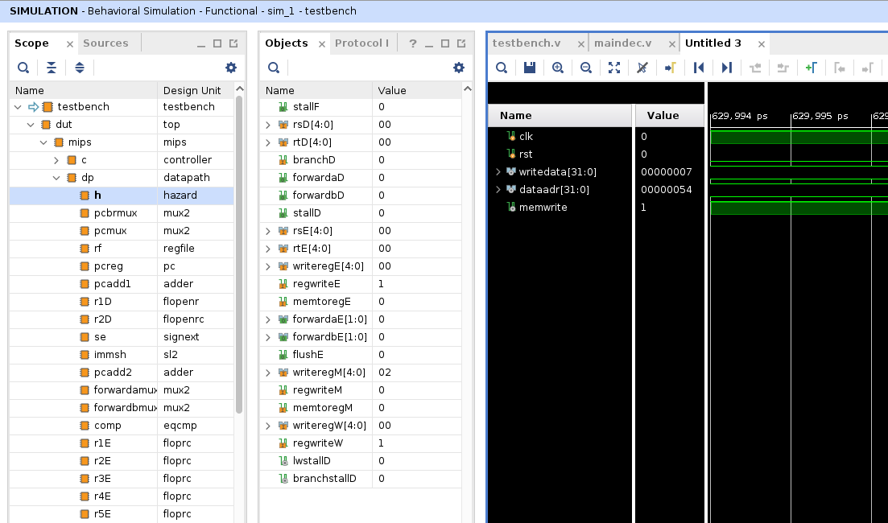
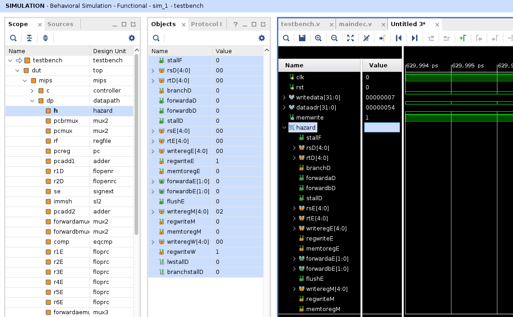
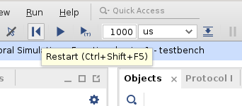
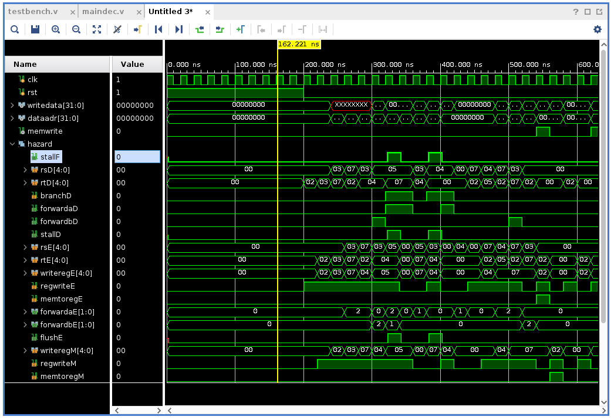
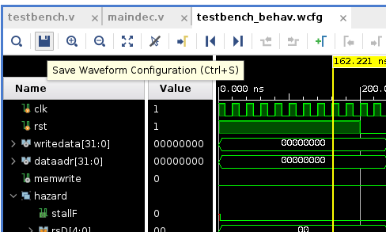
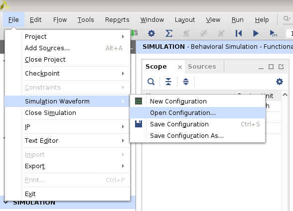

# 使用波形图调试

## 1. 点开Scope，找到需要调试的对象

左边的Scope是按照模块名称划分的，可以不断展开找到自己需要调试的模块。

## 2. 将调试对象加入波形图

可以在右边先点击右键，然后选择New Group，再把左边的调试对象选中，拖入到右边的波形图窗口中。

## 3. 重启仿真

点击上面的`restart`，然后点击其右边的按钮`run all`。

## 4. 观察仿真结果

## 5. 保存仿真波形图，供下次使用

点击保存按钮，找一个地方保存波形图。

## 6. 载入波形图

如果Vivado工程中没有自动载入上次保存的波形图，可以在`File`->`Simulation Waveform`->`Open Configuration`中打开。