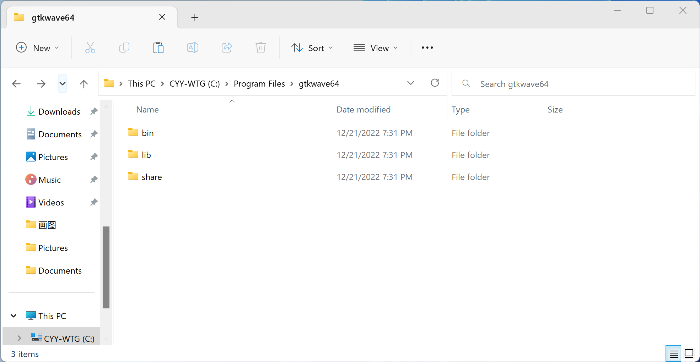
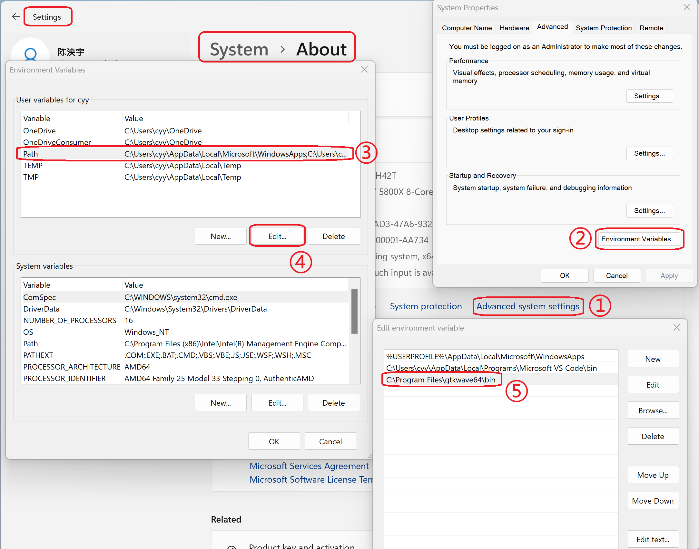
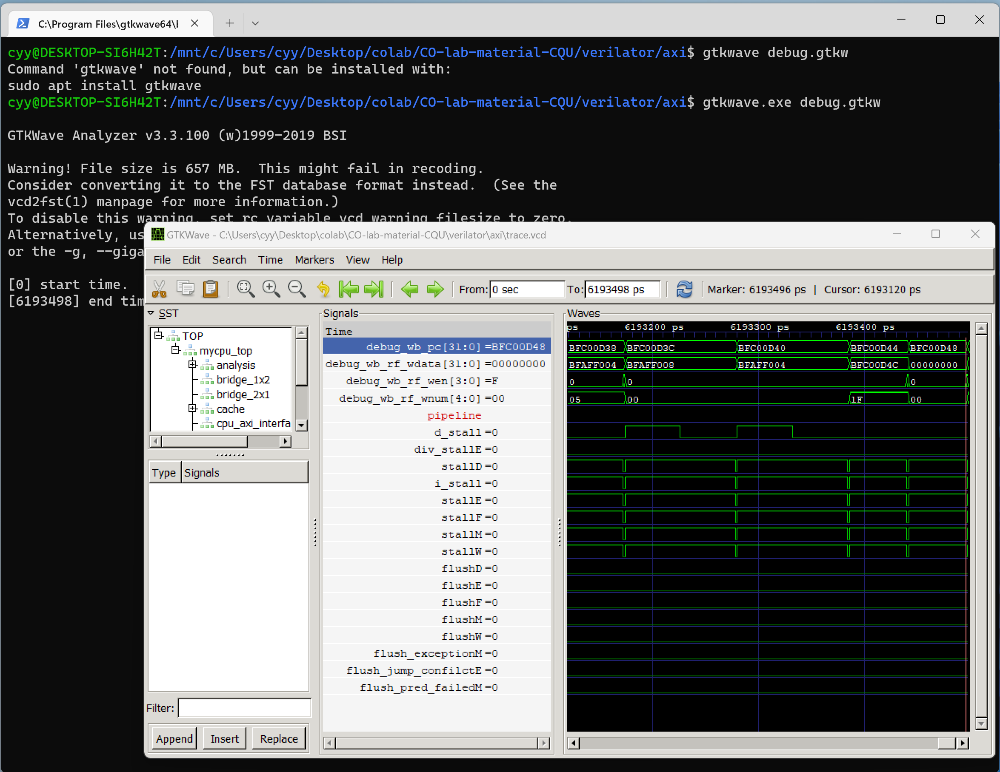

## Windows 10下原生运行 GTKWave 方法

由于有些同学还在使用Windows 10，且由于软件兼容性等原因不方便升级Windows 11，这里介绍一个Windows 10下原生运行GTKWave的方法。

### 1. 如已在WSL中安装过GTKWave，则先卸载。

进入WSL后使用以下命令：

```shell
sudo apt purge gtkwave
```

### 2. 下载GTKWave

我们可以到SourceForge上下载[gtkwave-3.3.100-bin-win64.zip](https://sourceforge.net/projects/gtkwave/files/gtkwave-3.3.100-bin-win64/gtkwave-3.3.100-bin-win64.zip/download)。


### 3. 解压，将gtkwave64文件夹任意找一个地方放置

推荐放置`C:\Program Files\gtkwave64`



### 4. 将`gtkwave64`文件夹中的bin添加到环境变量PATH中



1. 打开系统设置，找到`系统`-`关于`，然后点击`高级系统设置`。

2. 在`系统属性`窗口的`高级`选项卡中点击`环境变量`。

3. 在当前用户的环境变量中找到`Path`

4. 双击`Path`或点击下侧的`编辑`

5. 将`gtkwave64/bin`的文件存放位置添加到环境变量中。

6. 对步骤1后打开的每个窗口都点击`确定`保存环境变量配置，需要注意不能直接关闭，否则环境变量修改不会保存。（可以通过重新做该步骤检查环境变量是否被修改来检查。）

### 5. 重启终端/VSCode，此时应该能在WSL中直接使用gtkwave.exe启动gtkwave



如果还不能启动，可以注销重新登录当前用户或重启电脑。